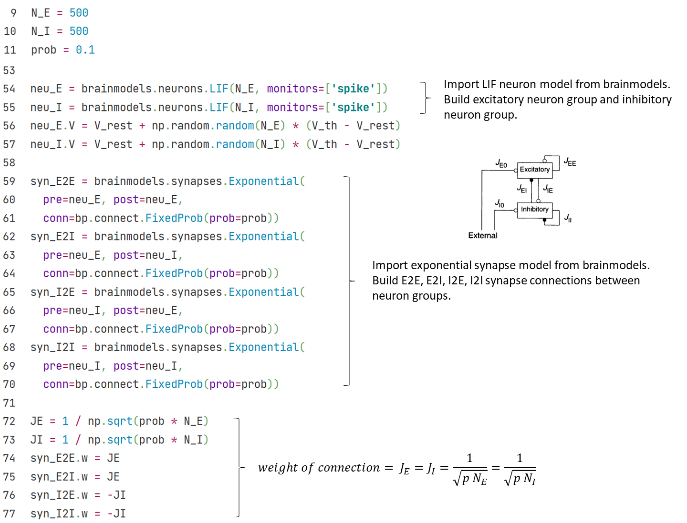
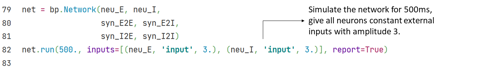
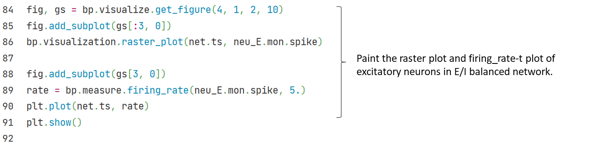

## 3.1.1 E/I balanced network

In 1990s, biologists found in experiments that neuron activities in brain cortex show a temporal irregular spiking pattern. This pattern exists widely in brain areas, but researchers knew few about its mechanism or function.

Vreeswijk and Sompolinsky (1996) proposed **E/I balanced network** to explain this irregular spiking pattern. The feature of this network is the strong, random and sparse synapse connections between neurons. Because of this feature and corresponding parameter settings, each neuron in the network will receive great excitatory and inhibitory input from within the network. However, these two types of inputs will cancel each other, and maintain the total internal input at a relatively small order of magnitude, which is only enough to generate action potentials.

The randomness and noise in E/I balanced network give  each neuron in the network an internal input which varies with time and space at the order of threshold potential. Therefore, the firing of neurons also has randomness, ensures that E/I balanced network can generate temporal irregular firing pattern spontaneously.

<b>Fig. 3-1 Structure of E/I balanced network (<cite>Vreeswijk and Sompolinsky, 1996 <a href="#fn_1">1</a></cite>)</b>

Vreeswijk and Sompolinsky also suggested a possible function of this irregular firing pattern: E/I balanced network can respond to the changes of external stimulus quickly.

As shown in Fig. 3-3, when there is no external input, the distribution of neurons’ membrane potentials in E/I balanced network follows a relatively uniform random distribution between resting potential $$V_0$$and threshold potential $$\theta$$.

<b>Fig. 3-2 Distribution of neuron membrane potentials in E/I balanced network (<cite>Tian et al.，2020 <a href="#fn_2">2</a></cite>)</b>

When we give the network a small constant external stimulus, those neurons whose membrane potentials fall near the threshold potential will soon meet the threshold, therefore spike rapidly. On the network scale, the firing rate of the network can adjust rapidly once the input changes.

Simulation suggests that the delay of network response to input and the delay of synapses have the same time scale, and both are significantly smaller than the delay of a single neuron from resting potential to generating a spike. So E/I balanced network may provide a fast response mechanism for neural networks. 

Fig. 3-1 shows the structure of E/I balanced network:

1)	Neurons: Neurons are realized with LIF neuron model. The neurons can be divided into excitatory neurons and inhibitory neurons, the ratio of the two types of neurons is $$N_E$$: $$N_I$$ = 4:1.

2)	Synapses: Synapses are realized with exponential synapse model. 4 groups of synapse connections are generated between the two groups of neurons, that is, excitatory-excitatory connection (E2E conn), excitatory-inhibitory connection (E2I conn), inhibitory-excitatory connection (I2E conn) and inhibitory-inhibitory connection (I2I conn). For excitatory or inhibitory synapse connections, we define synapse weights with different signal.

	

3)	Inputs: All neurons in the network receive a constant external input current.

	

See above section 1 and 2 for definition of LIF neuron and exponential synapse. After simulation, we visualize the raster plot and firing rate-t plot of E/I balanced network. the network firing rate changes from strong synchronization to irregular fluctuation.

	

------

### References

[1] Van Vreeswijk, Carl, and Haim Sompolinsky. "Chaos in neuronal networks with balanced excitatory and inhibitory activity." *Science* 274.5293 (1996): 1724-1726.

[2] Tian, Gengshuo, et al. "Excitation-Inhibition Balanced Neural Networks for Fast Signal Detection." *Frontiers in Computational Neuroscience* 14 (2020): 79.