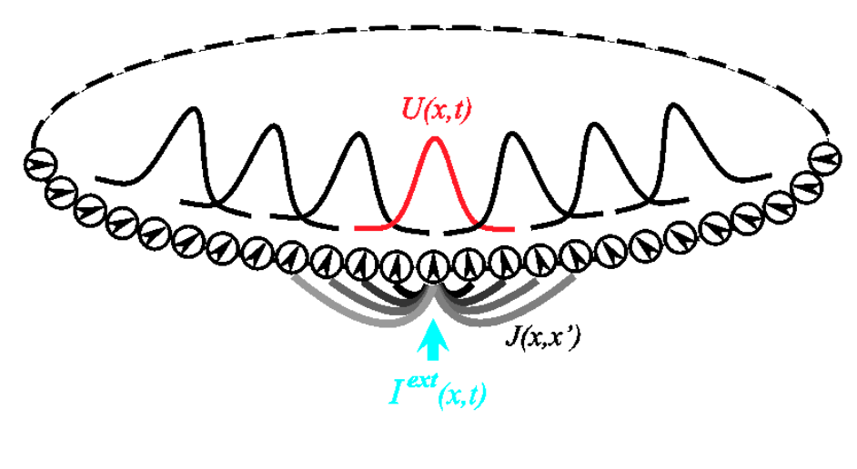
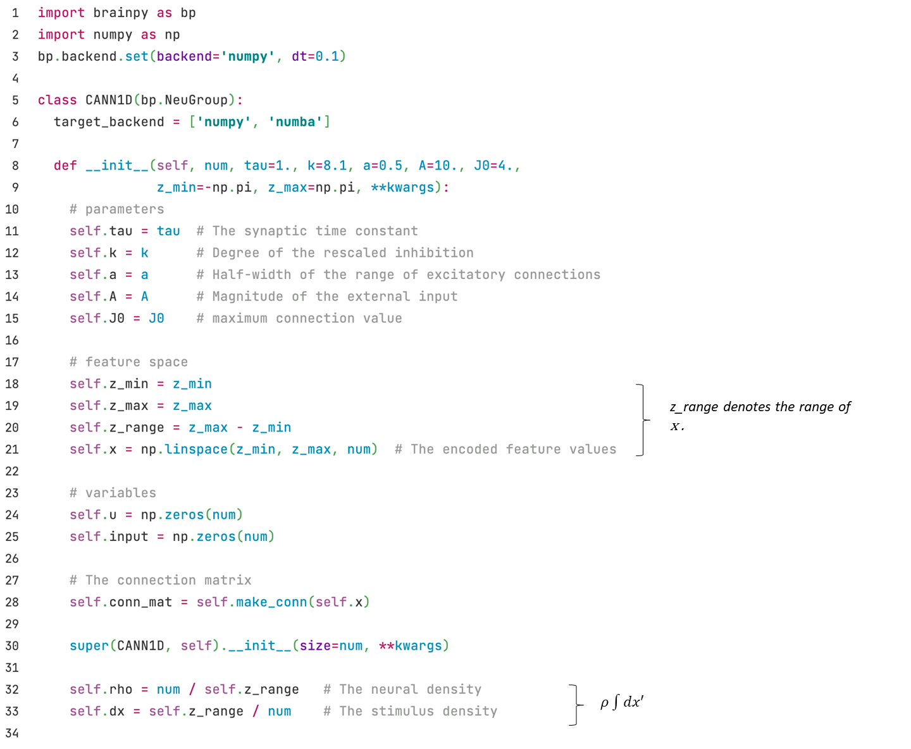
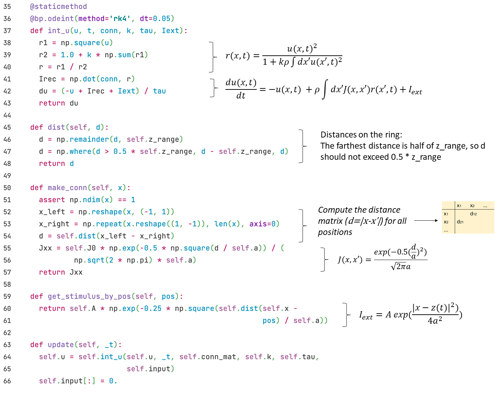

## 3.3 CANN

Let's see another example of firing rate model, a continuous attractor neural network (CANN)[^2]. Fig. 3-2 demonstrates the structure of one-dimensional CANN.

<div align="center">
  
  <br>
  <strong>Fig. 3-2 Structure of CANN.</strong> (From <cite>Wu et al., 2008 <sup><a href="#fn_2">2</a></sup></cite>)
</div>
<div><br></div>

We denote (x) as the parameter space site of the neuron group, and the dynamics of the total synaptic input of neuron group (x) $$u(x)$$ is given by:
$$
\tau \frac{du(x,t)}{dt} = -u(x,t) + \rho \int dx' J(x,x') r(x',t)+I_{ext}
$$

Where $$r(x', t)$$ is the firing rate of the neuron group (x'), which is given by:

$$
r(x,t) = \frac{u(x,t)^2}{1 + k \rho \int dx' u(x',t)^2}
$$

The intensity of excitatory connection between (x) and (x') $$J(x, x')$$ is given by a Gaussian function:

$$
J(x,x') = \frac{1}{\sqrt{2\pi}a}\exp(-\frac{|x-x'|^2}{2a^2})
$$

The external input $$I_{ext}$$ is related to position $$z(t)$$:

$$
I_{ext} = A\exp\left[-\frac{|x-z(t)|^2}{4a^2}\right]
$$

While implementing with BrainPy, we create a class of ``CANN1D`` by inheriting ``bp.NeuGroup``.



Then we define the functions.




Where the functions ``dist`` and ``make_conn`` are designed to get the connection strength $$J$$ between each of the two neuron groups. In the ``make_conn`` function, we first calculate the distance matrix between each of the two $$x$$. Because neurons are arranged in rings, the value of $$x$$ is between $$-\pi$$ and $$\pi$$, so the range of $$|x-x'|$$ is $$2\pi$$, and -$$\pi$$ and $$\pi$$ are the same points (the actual maximum value is $$\pi$$, that is, half of ``z_range``, the distance exceeded needs to be subtracted from a ``z_range``). We use the ``dist`` function to handle the distance on the ring.

<!--modify this???-->The ``get_stimulus_by_pos`` function processes external inputs based on position ``pos``, which allows users to get input current by setting target positions. For example, in a simple population coding, we give an external input of ``pos=0``, and we run in this way:

``` python
cann = CANN1D(num=512, k=0.1, monitors=['u'])

I1 = cann.get_stimulus_by_pos(0.)
Iext, duration = bp.inputs.constant_current([(0., 1.), (I1, 8.), (0., 8.)])
cann.run(duration=duration, inputs=('input', Iext))
```

Then lets plot an animation by calling the ``bp.visualize.animate_1D`` function.


```python
# define function
def plot_animate(frame_step=5, frame_delay=50):
    bp.visualize.animate_1D(dynamical_vars=[{'ys': cann.mon.u, 'xs': cann.x,
                                             'legend': 'u'}, {'ys': Iext,
                                             'xs': cann.x, 'legend': 'Iext'}],
                            frame_step=frame_step, frame_delay=frame_delay,
                            show=True)


# call the function
plot_animate(frame_step=1, frame_delay=100)
```


We can see that the shape of $$u$$ encodes/zh/ the shape of external input.

Now we add random noise to the external input to see how the shape of $$u$$ changes.


```python
cann = CANN1D(num=512, k=8.1, monitors=['u'])

dur1, dur2, dur3 = 10., 30., 0.
num1 = int(dur1 / bp.backend.get_dt())
num2 = int(dur2 / bp.backend.get_dt())
num3 = int(dur3 / bp.backend.get_dt())
Iext = np.zeros((num1 + num2 + num3,) + cann.size)
Iext[:num1] = cann.get_stimulus_by_pos(0.5)
Iext[num1:num1 + num2] = cann.get_stimulus_by_pos(0.)
Iext[num1:num1 + num2] += 0.1 * cann.A * np.random.randn(num2, *cann.size)
cann.run(duration=dur1 + dur2 + dur3, inputs=('input', Iext))

plot_animate()
```


We can see that the shape of $$u$$ remains like a bell shape, which indicates that it can perform template matching based on the input.

Now let's give a moving input, we vary the position of the input with ``np.linspace``, we will see that the $$u$$ will follow the input, i.e., smooth tracking.


```python
cann = CANN1D(num=512, k=8.1, monitors=['u'])

dur1, dur2, dur3 = 20., 20., 20.
num1 = int(dur1 / bp.backend.get_dt())
num2 = int(dur2 / bp.backend.get_dt())
num3 = int(dur3 / bp.backend.get_dt())
position = np.zeros(num1 + num2 + num3)
position[num1: num1 + num2] = np.linspace(0., 12., num2)
position[num1 + num2:] = 12.
position = position.reshape((-1, 1))
Iext = cann.get_stimulus_by_pos(position)
cann.run(duration=dur1 + dur2 + dur3, inputs=('input', Iext))

plot_animate()
```


### Reference

[^1]: Si Wu, Kosuke Hamaguchi, and Shun-ichi Amari. "Dynamics and computation of continuous attractors." Neural computation 20.4 (2008): 994-1025.