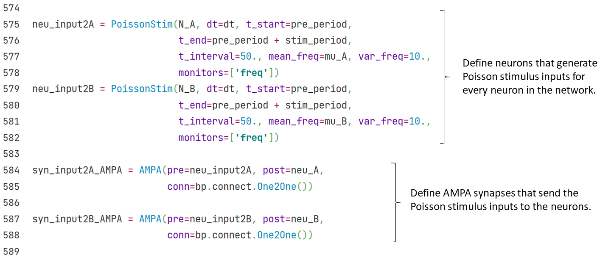

## 3.2 Decision Making Network

The modeling of computational neuroscience networks can correspond to specific physiological tasks. 

For example, in the visual motion discrimination task (Roitman and Shadlen, 2002), rhesus watch a video in which random dots move towards left or right with definite coherence. Rhesus are required to choose the direction that most dots move to and give their answer by saccade. At the meantime, researchers record the activity of their LIP neurons by implanted electrode.

<center> </center>

<center><b>Fig. 3-3 Experimental Diagram (<cite>Gerstner et al., 2014<sup><a href="#fn_1">1</a></sup></cite>)</b></center>

Wang et al. (2002; 2006) proposed the spiking neural network and firing rate neural network introduced in this section, aimed to model the activity of rhesus LIP neurons during decision making period in the visual motion discrimination task. 


------

### 3.2.1 Spiking Neural Network

Wang (2002) first proposed the decision making spiking network. As shown in Fig. 3-4, this network is based on E/I balanced network. The ratio of excitatory neurons and inhibitory neurons is $$N_E:N_I = 4:1$$, and parameters are adjusted to maintain the balanced state.

To accomplish the decision making task, among the excitatory neuron group, two selective subgroup A and B are chosen, both with a size of $$N_A = N_B = 0.15N_E$$. These two subgroups are marked as A and B in Fig. 3-5, and we call other excitatory neurons as non-selective neurons, $$N_{non} = (1-2*0.15)N_E$$.

<center></center>

<center><b>Fig. 3-4 structure of decision making network (<cite>Wang，2002<sup><a href="#fn_2">2</a></sup></cite>)</b></center>

<center>	</center>

As it is in E/I balanced network, 4 groups of synapses ---- E2E connection, E2I connection, I2E connection and I2I connection ---- are built in decision making network. Excitatory connections are realized with AMPA synapse, inhibitory connections are realized with GABAa synapse.

Decision making network needs to make a decision among the two choice, i.e., among the two subgroups A and B in this task. To achieve this, network must discriminate between these two groups. Excitatory neurons in the same subgroup should self-activate, and inhibit neurons in another selective subgroup. 

Therefore, E2E connections are structured in the network. As shown in Sheet 3-1, $$w+ > 1 > w-$$. In this way, a relative activation is established within the subgroups by stronger excitatory synapse connections, and relative inhibition is established between two subgroups or between selective and non-selective subgroups by weaker excitatory synapse connections.

<center><b>Sheet 3-1 Weight of synapse connections between E-neurons</b></center>

<center></center>

<center>	</center>

We give two types of external inputs to the decision making network:

1) Background inputs from other brain areas without specific meaning. Represented as high frequency Poisson input mediated by AMPA synapse.

<center>	</center>

2) Stimulus inputs from outside the brain, which are given only to the two selective subgroup A and B. Represented as lower frequency Poisson input mediated by AMPA synapse. 

The frequency of Poisson input given to A and B subgroup have a certain difference, simulate the difference in the number of dots moving to left and right in physiological experiments, induce the network to make a decision among these two subgroups.
$$
\rho_A = \rho_B = \mu_0/100
$$

$$
\mu_A = \mu_0 + \rho_A * c
$$

$$
\mu_B = \mu_0 + \rho_B * c
$$

Every 50ms, the Poisson frequencies $$f_x$$ change once, follows a Gaussian distribution defined by mean $$\mu_x$$ and variance $$\delta^2$$.
$$
f_A \sim N(\mu_A, \delta^2)
$$

$$
f_B \sim N(\mu_B, \delta^2)
$$

<center>	</center>

<center>	</center>

During the simulation, subgroup A receives a larger stimulus input than B, after a definite delay period, the activity of group A is significantly higher than group B, which means, the network chooses the right direction.

<center></center>


------

### 3.2.2 Firing rate model

In addition to spiking models, BrainPy can also implement Firing rate models. Let's first look at the implementation of a simplified version of the decision model. The model was simplified by the researcher (Wong & Wang, 2006) through a series of means such as mean field approach. In the end, there are only two variables, $$S_1$$ and $$S_2$$, which respectively represent the state of two neuron groups and correspond to two options.

<div align="center">
  
  <br>
  <strong>Fig. 3-1 Reduced decision model.</strong> (From <cite>Wong & Wang, 2006 <sup><a href="#fn_3">3</a></sup></cite>)
</div>
<div><br></div>

The model is given by,

$$
\frac{dS_1} {dt} = -\frac {S_1} \tau + (1-S_1) \gamma r_1
$$

$$
\frac{dS_2} {dt} = -\frac {S_2} \tau + (1-S_2) \gamma r_2
$$

where $$r_1 $$ and $$r_2$$ is the firing rate of two neuron groups, which is given by the input-output function,

$$
r_i = f(I_{syn, i})
$$

$$
f(I)= \frac {aI-b} {1- \exp [-d(aI-b)]}
$$

where $$I_{syn, i}$$ is given by the model structure (Fig. 3-1),

$$
I_{syn, 1} = J_{11} S_1 - J_{12} S_2 + I_0 + I_1
$$

$$
I_{syn, 2} = J_{22} S_2 - J_{21} S_1 + I_0 + I_2
$$


where $$I_0$$ is the background current, and the external inputs $$I_1, I_2$$ are determined by the total input strength $$\mu_0$$ and a coherence $$c'$$. The higher the coherence, the more definite $$S_1$$ is the correct answer, while the lower the coherence, the more random it is. The formula is as follows:

$$
I_1 = J_{\text{A, ext}} \mu_0 (1+\frac {c'}{100\%})
$$

$$
I_2 = J_{\text{A, ext}} \mu_0 (1-\frac {c'}{100\%})
$$


The code implementation is as follows: we can create a neuron group class, and use $$S_1$$ and $$S_2$$ to store the two states of the neuron group. The dynamics of the model can be implemented by a ``derivative`` function for dynamics analysis.


Then we can define a function to perform phase plane analysis.


Let's first look at the case when there is no external input. At this time, $$\mu_0 = 0$$.

``` python
phase_analyze(I=0., coh=0.)
```

Output:

    plot nullcline ...
    plot fixed point ...
    Fixed point #1 at s2=0.06176109215560733, s1=0.061761097890810475 is a stable node.
    Fixed point #2 at s2=0.029354239100062428, s1=0.18815448592736211 is a saddle node.
    Fixed point #3 at s2=0.0042468423702408655, s1=0.6303045696241589 is a stable node.
    Fixed point #4 at s2=0.6303045696241589, s1=0.004246842370235128 is a stable node.
    Fixed point #5 at s2=0.18815439944520335, s1=0.029354240536530615 is a saddle node.
    plot vector field ...


It can be seen that it is very convenient to use BrainPy for dynamics analysis. The vector field and fixed point indicate which option will fall in the end under different initial values.

Here, the x-axis is $$S_2$$ which represents choice 2, and the y-axis is $$S_1$$, which represents choice 1. As you can see, the upper-left fixed point represents choice 1, the lower-right fixed point represents choice 2, and the lower-left fixed point represents no choice.

Now let's see which option will eventually fall under different initial values with different coherence, and we fix the external input strength to 30.

Now let's look at the phase plane under different coherences when we fix the external input strength to 30.


```python
# coherence = 0%
print("coherence = 0%")
phase_analyze(I=30., coh=0.)

# coherence = 51.2%
print("coherence = 51.2%")
phase_analyze(I=30., coh=0.512)

# coherence = 100%
print("coherence = 100%")
phase_analyze(I=30., coh=1.)
```

    coherence = 0%
    plot nullcline ...
    plot fixed point ...
    Fixed point #1 at s2=0.6993504413889349, s1=0.011622049526766405 is a stable node.
    Fixed point #2 at s2=0.49867489858358865, s1=0.49867489858358865 is a saddle node.
    Fixed point #3 at s2=0.011622051540013889, s1=0.6993504355529329 is a stable node.
    plot vector field ...


    coherence = 51.2%
    plot nullcline ...
    plot fixed point ...
    Fixed point #1 at s2=0.5673124813731691, s1=0.2864701069327971 is a saddle node.
    Fixed point #2 at s2=0.6655747347157656, s1=0.027835279565912054 is a stable node.
    Fixed point #3 at s2=0.005397687847426814, s1=0.7231453520305031 is a stable node.
    plot vector field ...


    coherence = 100%
    plot nullcline ...
    plot fixed point ...
    Fixed point #1 at s2=0.0026865954387078755, s1=0.7410985604497689 is a stable node.
    plot vector field ...


### References

<span id="fn_1"></span>[1] Gerstner, Wulfram, et al. Neuronal dynamics: From single neurons to networks and models of cognition. Cambridge University Press, 2014.

<span id="fn_2"></span>[2] Wang, Xiao-Jing. "Probabilistic decision making by slow reverberation in cortical circuits." *Neuron* 36.5 (2002): 955-968.

<span id="fn_3"></span>[3] Wong, K.-F. & Wang, X.-J. A Recurrent Network Mechanism of Time Integration in Perceptual Decisions.  J. Neurosci. 26, 1314–1328 (2006).