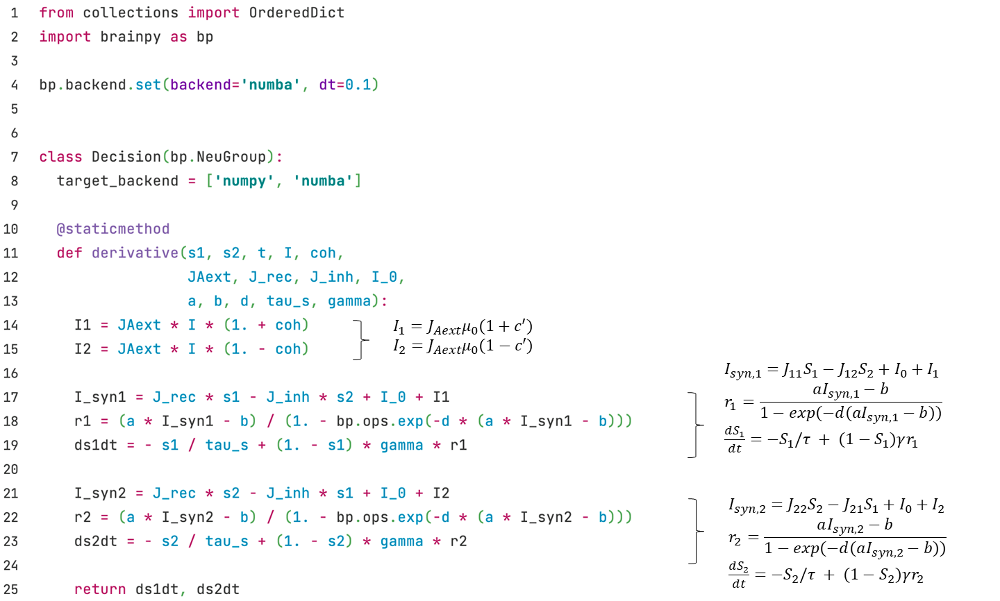
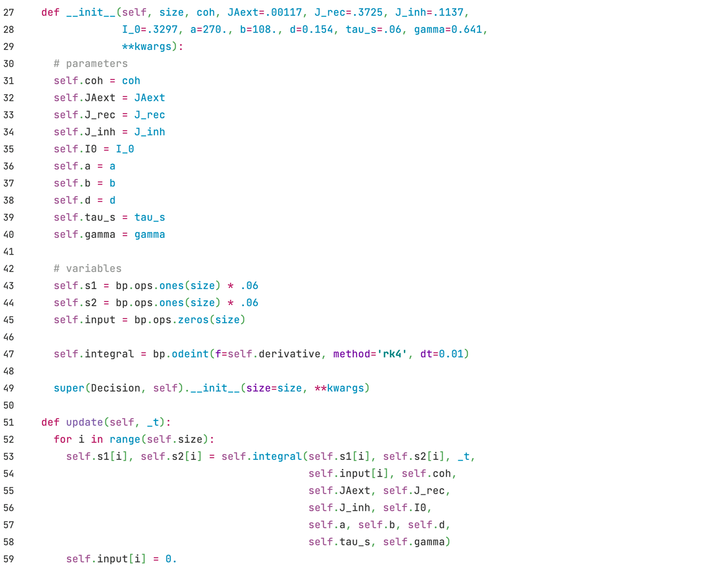
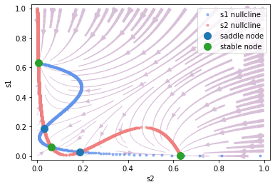

## 3.2 Firing rate networks

### 3.2.1 Decision model

In addition to spiking models, BrainPy can also implement Firing rate models. Let's first look at the implementation of a simplified version of the decision model. The model was simplified by the researcher (Wong & Wang, 2006)[^1] through a series of means such as mean field approach. In the end, there are only two variables, $$S_1$$ and $$S_2$$, which respectively represent the state of two neuron groups and correspond to two options.

<div align="center">
  
  <br>
  <strong>Fig. 3-1 Reduced decision model.</strong> (From <cite>Wong & Wang, 2006 <sup><a href="#fn_1">1</a></sup></cite>)
</div>
<div><br></div>

The model is given by,

$$
\frac{dS_1} {dt} = -\frac {S_1} \tau + (1-S_1) \gamma r_1
$$

$$
\frac{dS_2} {dt} = -\frac {S_2} \tau + (1-S_2) \gamma r_2
$$

where $$r_1 $$ and $$r_2$$ is the firing rate of two neuron groups, which is given by the input-output function,

$$
r_i = f(I_{syn, i})
$$

$$
f(I)= \frac {aI-b} {1- \exp [-d(aI-b)]}
$$

where $$I_{syn, i}$$ is given by the model structure (Fig. 3-1),

$$
I_{syn, 1} = J_{11} S_1 - J_{12} S_2 + I_0 + I_1
$$

$$
I_{syn, 2} = J_{22} S_2 - J_{21} S_1 + I_0 + I_2
$$


where $$I_0$$ is the background current, and the external inputs $$I_1, I_2$$ are determined by the total input strength $$\mu_0$$ and a coherence $$c'$$. The higher the coherence, the more definite $$S_1$$ is the correct answer, while the lower the coherence, the more random it is. The formula is as follows:

$$
I_1 = J_{\text{A, ext}} \mu_0 (1+\frac {c'}{100\%})
$$

$$
I_2 = J_{\text{A, ext}} \mu_0 (1-\frac {c'}{100\%})
$$


The code implementation is as follows: we can create a neuron group class, and use $$S_1$$ and $$S_2$$ to store the two states of the neuron group. The dynamics of the model can be implemented by a ``derivative`` function for dynamics analysis.






Then we can define a function to perform phase plane analysis.


Let's first look at the case when there is no external input. At this time, $$\mu_0 = 0$$.

``` python
phase_analyze(I=0., coh=0.)
```

Output:

    plot nullcline ...
    plot fixed point ...
    Fixed point #1 at s2=0.06176109215560733, s1=0.061761097890810475 is a stable node.
    Fixed point #2 at s2=0.029354239100062428, s1=0.18815448592736211 is a saddle node.
    Fixed point #3 at s2=0.0042468423702408655, s1=0.6303045696241589 is a stable node.
    Fixed point #4 at s2=0.6303045696241589, s1=0.004246842370235128 is a stable node.
    Fixed point #5 at s2=0.18815439944520335, s1=0.029354240536530615 is a saddle node.
    plot vector field ...





It can be seen that it is very convenient to use BrainPy for dynamics analysis. The vector field and fixed point indicate which option will fall in the end under different initial values.

Here, the x-axis is $$S_2$$ which represents choice 2, and the y-axis is $$S_1$$, which represents choice 1. As you can see, the upper-left fixed point represents choice 1, the lower-right fixed point represents choice 2, and the lower-left fixed point represents no choice.

Now let's see which option will eventually fall under different initial values with different coherence, and we fix the external input strength to 30.

Now let's look at the phase plane under different coherences when we fix the external input strength to 30.


```python
# coherence = 0%
print("coherence = 0%")
phase_analyze(I=30., coh=0.)

# coherence = 51.2%
print("coherence = 51.2%")
phase_analyze(I=30., coh=0.512)

# coherence = 100%
print("coherence = 100%")
phase_analyze(I=30., coh=1.)
```

    coherence = 0%
    plot nullcline ...
    plot fixed point ...
    Fixed point #1 at s2=0.6993504413889349, s1=0.011622049526766405 is a stable node.
    Fixed point #2 at s2=0.49867489858358865, s1=0.49867489858358865 is a saddle node.
    Fixed point #3 at s2=0.011622051540013889, s1=0.6993504355529329 is a stable node.
    plot vector field ...


    coherence = 51.2%
    plot nullcline ...
    plot fixed point ...
    Fixed point #1 at s2=0.5673124813731691, s1=0.2864701069327971 is a saddle node.
    Fixed point #2 at s2=0.6655747347157656, s1=0.027835279565912054 is a stable node.
    Fixed point #3 at s2=0.005397687847426814, s1=0.7231453520305031 is a stable node.
    plot vector field ...


    coherence = 100%
    plot nullcline ...
    plot fixed point ...
    Fixed point #1 at s2=0.0026865954387078755, s1=0.7410985604497689 is a stable node.
    plot vector field ...


### 3.2.2 CANN

Let's see another example of firing rate model, a continuous attractor neural network (CANN)[^2]. Fig. 3-2 demonstrates the structure of one-dimensional CANN.

<div align="center">
  
  <br>
  <strong>Fig. 3-2 Structure of CANN.</strong> (From <cite>Wu et al., 2008 <sup><a href="#fn_2">2</a></sup></cite>)
</div>
<div><br></div>

We denote (x) as the parameter space site of the neuron group, and the dynamics of the total synaptic input of neuron group (x) $$u(x)$$ is given by:
$$
\tau \frac{du(x,t)}{dt} = -u(x,t) + \rho \int dx' J(x,x') r(x',t)+I_{ext}
$$

Where $$r(x', t)$$ is the firing rate of the neuron group (x'), which is given by:

$$
r(x,t) = \frac{u(x,t)^2}{1 + k \rho \int dx' u(x',t)^2}
$$

The intensity of excitatory connection between (x) and (x') $$J(x, x')$$ is given by a Gaussian function:

$$
J(x,x') = \frac{1}{\sqrt{2\pi}a}\exp(-\frac{|x-x'|^2}{2a^2})
$$

The external input $$I_{ext}$$ is related to position $$z(t)$$:

$$
I_{ext} = A\exp\left[-\frac{|x-z(t)|^2}{4a^2}\right]
$$

While implementing with BrainPy, we create a class of ``CANN1D`` by inheriting ``bp.NeuGroup``.


Then we define the functions.


Where the functions ``dist`` and ``make_conn`` are designed to get the connection strength $$J$$ between each of the two neuron groups. In the ``make_conn`` function, we first calculate the distance matrix between each of the two $$x$$. Because neurons are arranged in rings, the value of $$x$$ is between $$-\pi$$ and $$\pi$$, so the range of $$|x-x'|$$ is $$2\pi$$, and -$$\pi$$ and $$\pi$$ are the same points (the actual maximum value is $$\pi$$, that is, half of ``z_range``, the distance exceeded needs to be subtracted from a ``z_range``). We use the ``dist`` function to handle the distance on the ring.

<!--modify this???-->The ``get_stimulus_by_pos`` function processes external inputs based on position ``pos``, which allows users to get input current by setting target positions. For example, in a simple population coding, we give an external input of ``pos=0``, and we run in this way:

``` python
cann = CANN1D(num=512, k=0.1, monitors=['u'])

I1 = cann.get_stimulus_by_pos(0.)
Iext, duration = bp.inputs.constant_current([(0., 1.), (I1, 8.), (0., 8.)])
cann.run(duration=duration, inputs=('input', Iext))
```

Then lets plot an animation by calling the ``bp.visualize.animate_1D`` function.


```python
# define function
def plot_animate(frame_step=5, frame_delay=50):
    bp.visualize.animate_1D(dynamical_vars=[{'ys': cann.mon.u, 'xs': cann.x,
                                             'legend': 'u'}, {'ys': Iext,
                                             'xs': cann.x, 'legend': 'Iext'}],
                            frame_step=frame_step, frame_delay=frame_delay,
                            show=True)


# call the function
plot_animate(frame_step=1, frame_delay=100)
```


We can see that the shape of $$u$$ encodes/zh/ the shape of external input.

Now we add random noise to the external input to see how the shape of $$u$$ changes.


```python
cann = CANN1D(num=512, k=8.1, monitors=['u'])

dur1, dur2, dur3 = 10., 30., 0.
num1 = int(dur1 / bp.backend.get_dt())
num2 = int(dur2 / bp.backend.get_dt())
num3 = int(dur3 / bp.backend.get_dt())
Iext = np.zeros((num1 + num2 + num3,) + cann.size)
Iext[:num1] = cann.get_stimulus_by_pos(0.5)
Iext[num1:num1 + num2] = cann.get_stimulus_by_pos(0.)
Iext[num1:num1 + num2] += 0.1 * cann.A * np.random.randn(num2, *cann.size)
cann.run(duration=dur1 + dur2 + dur3, inputs=('input', Iext))

plot_animate()
```


We can see that the shape of $$u$$ remains like a bell shape, which indicates that it can perform template matching based on the input.

Now let's give a moving input, we vary the position of the input with ``np.linspace``, we will see that the $$u$$ will follow the input, i.e., smooth tracking.


```python
cann = CANN1D(num=512, k=8.1, monitors=['u'])

dur1, dur2, dur3 = 20., 20., 20.
num1 = int(dur1 / bp.backend.get_dt())
num2 = int(dur2 / bp.backend.get_dt())
num3 = int(dur3 / bp.backend.get_dt())
position = np.zeros(num1 + num2 + num3)
position[num1: num1 + num2] = np.linspace(0., 12., num2)
position[num1 + num2:] = 12.
position = position.reshape((-1, 1))
Iext = cann.get_stimulus_by_pos(position)
cann.run(duration=dur1 + dur2 + dur3, inputs=('input', Iext))

plot_animate()
```


### Reference

[^1]: Wong, K.-F. & Wang, X.-J. A Recurrent Network Mechanism of Time Integration in Perceptual Decisions.  J. Neurosci. 26, 1314–1328 (2006).
[^2]: Si Wu, Kosuke Hamaguchi, and Shun-ichi Amari. "Dynamics and computation of continuous attractors." Neural computation 20.4 (2008): 994-1025.