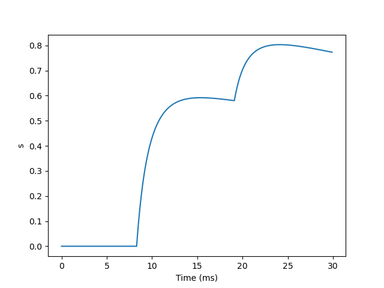
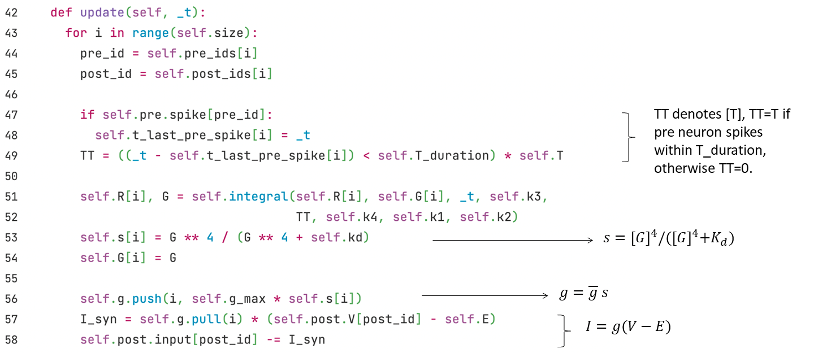
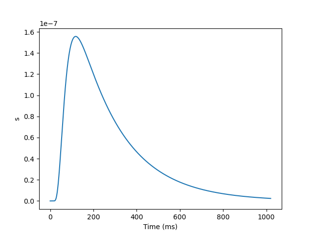
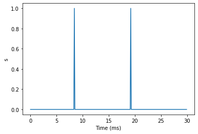
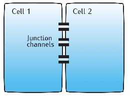
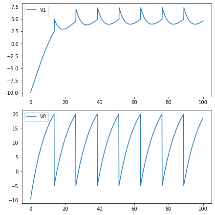

## 2.1 Synaptic Models

We have learned how to model the action potential of neurons in the previous chapters, so how are the neurons connected? How are the action potentials of neurons transmitted between different neurons? Here, we will introduce how to use BrainPy to simulate the communication between neurons.

### 2.1.1 Chemical Synapses

#### Biological Background

Figure 2-1 describes the biological process of information transmission between neurons. When the action potential of a presynaptic neuron is transmitted to the terminal of the axon, the presynaptic neuron releases **neurotransmitters** (also called transmitters). Neurotransmitters bind to receptors on postsynaptic neurons to cause changes in the membrane potential of postsynaptic neurons. These changes are called post-synaptic potential (PSP). Depending on the type of neurotransmitter, postsynaptic potentials can be excitatory or inhibitory. For example, **Glutamate** is an important excitatory neurotransmitter, while **GABA** is an important inhibitory neurotransmitter.

The binding of neurotransmitters and receptors may cause the opening of ion channels (**ionotype** receptors) or change the process of chemical reactions (**metabolic** receptors).

In this section, we will introduce how to use BrainPy to implement some common synapse models, mainly:

- **AMPA** and **NMDA**: They are both ionotropic receptors of glutamate, which can open ion channels directly after being bound. But NMDA is usually blocked by magnesium ions (Mg$$^{2+}$$) and cannot respond to the glutamate. Since magnesium ions are sensitive to voltage, when the postsynaptic potential exceeds the threshold of magnesium ions, magnesium ions will leave the NMDA channel, allowing NMDA to respond to glutamate. Therefore, the dynamics of NMDA are much slower than that of AMPA.
- **GABA<sub>A</sub>** and **GABA<sub>B</sub>**: They are two classes of GABA receptors, of which GABA<sub>A</sub> are ionotropic receptors that typically produce fast inhibitory potentials; while GABA<sub>B</sub> are metabotropic receptors that typically produce slow inhibitory potentials.


<div style="text-align:center">
  
  <br>
    <strong> Fig. 2-1 Biological Synapse </strong> (Adapted from <cite  id="reffn_1">Gerstner et al., 2014 <sup><a href="#fn_1">1</a></sup></cite>)
</div>
<div><br></div>

In order to model the process from neurotransmitter release to the alter of the membrane potential of postsynaptic neurons, we use a gating variable $$s$$ to describe how many portion of ion channels will be opened whenever a presynaptic neuron generates an action potential. Let's start with an example of AMPA and see how to develop a synapse model and implement it with ``BrainPy``.


#### AMPA Synapse

As we mentioned before, the AMPA receptor is an ionotropic receptor, that is, when a neurotransmitter binds to it, the ion channel will be opened immediately to allow Na$$^+$$ and K$$^+$$ ions flux.

We can use Markov process to describe the opening and closing process of ion channels. As shown in Fig. 2-2,  $$s$$ represents the probability of channel opening, $$1-s$$ represents the probability of ion channel closing, and $$\alpha$$ and $$\beta$$ are the transition probability. Because neurotransmitters can open ion channels, the transfer probability from $$1-s$$ to $$s$$ is affected by the concentration of neurotransmitters. We denote the concentration of neurotransmitters as [T].

<div style="text-align:center">
   
  <br>	
  <strong> Fig. 2-2 Markov process of channel dynamics </strong>
</div>
<div><br></div>

We obtained the following formula when describing the process by a differential equation.

$$
\frac {ds}{dt} = \alpha [T] (1-s) - \beta s
$$

Where $$\alpha [T]$$ denotes the transition probability from state $$(1-s)$$ to state $$(s)$$; and $$\beta$$ represents the transition probability of the other direction.

Now let's see how to implement such a model with BrainPy. First of all, we need to define a class that inherits from `` bp.TwoEndConn ``, because synapses connect two neurons. Within the class, we can define the differential equation with ``derivative`` function, this is the same as the definition of neuron models. Then we use the ``__ init__ `` Function to initialize the required parameters and variables.


We update $$s$$ by an ``update`` function.


After the implementation, we can plot the graph of $$s$$ changing with time. We would first write a ``run_syn`` function to run and plot the graph. To run a synapse, we need neuron groups, so we use the LIF neuron provided by ``brainmodels`` package.


Then we would expect to see the following result:


As can be seen from the above figure, when the presynaptic neurons fire, the value of $$s$$ will first increase, and then decay.

#### NMDA Synapse

As we mentioned before, the NMDA receptors are blocked by Mg$$^{2+}$$, which would move away as the change of membrane potentials. We denote the concentration of Mg$$^2+$$ as $$c_{Mg}$$, and its effect on membrane conductance $$g$$ is given by,
$$
g_{\infty} =(1+{e}^{-\alpha V} \cdot \frac{c_{Mg} } {\beta})^{-1}
$$

$$
g = \bar{g} \cdot g_{\infty}  s
$$

where $$g_{\infty}$$ represents the effect of magnesium ion concentration, and its value decreases as the magnesium ion concentration increases. With the increase of the voltage $$V$$, the effect of $$c_{Mg}$$ on $$g_{\infty}$$ decreases. $$\alpha, \beta$$ and $$\bar{g}$$ are some constants。The dynamic of gating variable $$s$$ is similar with the AMPA synapse, which is given by,
$$
\frac{d s}{dt} =-\frac{s}{\tau_{\text{decay}}}+a x(1-s)
$$

$$
\frac{d x}{dt} =-\frac{x}{\tau_{\text{rise}}}
$$

$$
\text{if (pre fire), then} \ x \leftarrow x+ 1
$$

where $$\tau_{\text{decay}}$$ and $$\tau_{\text{rise}}$$ are time constants of $$s$$ decay and rise, respectively. $$a$$ is a parameter.

Then let's implement the NMDA synapse with BrainPy. Here are the codes:


As we've already defined the ``run_syn`` function while implementing the AMPA synapse, we can directly call it here.

``` python
run_syn(NMDA)
```



The result shows that the decay of NMDA is very slow and we barely see the decay from this 30ms simulation.


#### GABA<sub>B</sub> Synapse

GABA<sub>B</sub> is a metabotropic receptor, so it would not directly open the ion channels after the neurotransmitter binds to the receptor, but act through G protein as a second messenger. We denote $$[R]$$ as the proportions of activated receptors, and $$[G]$$ represents the concentration of activated G proteins. $$s$$ is modulated by $$[G]$$, which is given by,
$$
\frac{d[R]}{dt} = k_3 [T](1-[R])- k_4 [R]
$$

$$
\frac{d[G]}{dt} = k_1 [R]- k_2 [G]
$$

$$
s =\frac{[G]^{4}} {[G]^{4}+K_{d}}
$$

The kinetics of $$[R]$$ is similar to that of $$s$$ in the AMPA model, which is affected by the neurotransmitter concentration $$[T]$$, and $$k_3, k_4$$ represent the transition probability. The dynamics of $$[G]$$ is affected by $$[R]$$ with parameters $$k_1, k_2$$. $$K_d$$ is a constant.

Here are the codes of the BrainPy implementation.




Since the dynamics of GABA<sub>B</sub> is very slow, we no longer use the ``run_syn`` function here, but use ``bp.inputs.constant_current`` to give stimulation for 20ms, and then look at the decay at the subsequent 1000ms without external inputs.

``` python
neu1 = bm.neurons.LIF(2, monitors=['V'])
neu2 = bm.neurons.LIF(3, monitors=['V'])
syn = GABAb(pre=neu1, post=neu2, conn=bp.connect.All2All(), monitors=['s'])
net = bp.Network(neu1, syn, neu2)

# input
I, dur = bp.inputs.constant_current([(25, 20), (0, 1000)])
net.run(dur, inputs=(neu1, 'input', I))

bp.visualize.line_plot(net.ts, syn.mon.s, ylabel='s', show=True)
```



The result shows that the decay of GABA<sub>B</sub> lasts for hundreds of milliseconds.


#### Current-based and Conductance-based synapses

You may have noticed that the modeling of the gating variable $$s$$ of the GABA<sub>B</sub> synapse did not show its property of inducing inhibitory potentials. To demonstrate the excitatory and inhibitory properties, we not only need to model the gating variable $$s$$, but also the current $$I$$ through the synapses (as input to the postsynaptic neurons). There are two different methods to model the relationships between $$s$$ and $$I$$: **current-based** and **conductance-based**. The main difference between them is whether the synaptic current is influenced by the membrane potential of postsynaptic neurons.

##### (1) Current-based

The formula of the current-based model is as follow:

$$
I \propto s
$$

While coding, we usually multiply $$s$$ by a weight $$w$$. We can implement excitatory and inhibitory synapses by adjusting the positive and negative values of the weight $$w$$.

The delay of synapses is implemented by applying the delay time to the ``I_syn`` variable using the ``register_constant_delay`` function provided by BrainPy.


##### (2) Conductance-based

In the conductance-based model, the conductance is $$g=\bar{g} s$$. Therefore, according to Ohm's law, the formula is given by:
$$
I=\bar{g}s(V-E)
$$

Here $$E$$ is a reverse potential, which can determine whether the effect of $$I$$ is inhibition or excitation. For example, when the resting potential is about -65, subtracting a lower $$E$$, such as -75, will become positive, thus will change the direction of the current in the formula and produce the suppression current. The $$E$$ value of excitatory synapses is relatively high, such as 0.

In terms of implementation, you can apply a synaptic delay to the variable ``g``.


Now let's review the NMDA and GABA<sub>B</sub> synapses we just implemented. They are both conductance-based models. Excitatory currents are induced by $$E=0$$ in the NMDA synapse; while inhibitory currents are produced by $$E=-95$$ in the GABA<sub>B</sub> synapse. You can find the complete code to the above models from our [BrainModels](https://github.com/PKU-NIP-Lab/BrainModels/tree/main/brainmodels/numba_backend/synapses) GitHub repository.


#### Abstract reduced models

The dynamics of the gating variables $$s$$ of the above chemical synapses sharing the same characteristic of rising first and then decay. Sometimes we don't need to use models that specifically correspond to biological synapses. Therefore, some abstract synaptic models have been proposed. Here, we will introduce the implementation of four abstract models on BrainPy, they can be either current-based or conductance-based. These models can also be found in the [BrainModels](https://brainmodels.readthedocs.io/en/latest/apis/synapses.html) repository.

##### (1) Differences of two exponentials

Let's first introduce the ``Differences of two exponentials`` model, its dynamics is given by,

$$
s = \frac {\tau_1 \tau_2}{\tau_1 - \tau_2} (\exp(-\frac{t - t_s}{\tau_1})
- \exp(-\frac{t - t_s}{\tau_2}))
$$

Where $$t_s$$ denotes the spike timing of the presynatic neuron, $$\tau_1$$ and $$\tau_2$$ are time constants.

While implementing with BrainPy, we use the following differential equation form,
$$
		\frac {ds} {dt} = x
$$

$$
 \frac {dx}{dt} =- \frac{\tau_1+\tau_2}{\tau_1 \tau_2}x - \frac s {\tau_1 \tau_2}
$$

$$
\text{if (fire), then} \ x \leftarrow x+ 1
$$

Here we specify the logic of increment of $$x$$ in the ``update`` function when the presynaptic neurons fire. The code is as follows:


Then we expect to see the following result:


##### (2) Alpha synapse

Dynamics of ``Alpha synapse`` is given by, 
$$
s = \frac{t - t_s}{\tau} \exp(-\frac{t - t_s}{\tau})
$$
As the dual exponential synapse,  $$t_s$$ denotes the spike timing of the presynaptic neuron, with a time constant $$\tau$$.

The differential equation form of alpha synapse is also very similar with the dual exponential synapses, with $$\tau = \tau_1 = \tau_2$$, as shown below:
$$
\frac {ds} {dt} = x
$$

$$
 \frac {dx}{dt} =- \frac{2x}{\tau} - \frac s {\tau^2}
$$

$$
\text{if (fire), then} \ x \leftarrow x+ 1
$$

Code implementation is similar:


Then we expect to see the following result:


##### (3) Single exponential decay

Sometimes we can ignore the rising process in modeling, and only need to model the decay process. Therefore, the formula of ``single exponential decay`` model is more simplified:

$$
\frac {ds}{dt}=-\frac s {\tau_{decay}}
$$

$$
\text{if (fire), then} \ s \leftarrow s+1
$$

The implementing code is given by:


Then we expect to see the following result:


##### (4) Voltage jump

Sometimes even the decay process can be ignored, so there is a ``voltage jump`` model, which is given by:

$$
\text{if (fire), then} \ s \leftarrow s+1
$$

The code is as follows:


Then we expect to see the following result:





### 2.1.2 Electrical Synapses

In addition to the chemical synapses described earlier, electrical synapses are also common in our neural system.

<div  style="text-align:center">
    <div style="display:grid;grid-template-columns: 1fr 3fr 1fr 3fr;grid-template-rows:1fr 3fr;justify-items:center;align-items:center">
      <div style="grid-column:1;grid-row:1;align-self:end;justify-self:end">
        <strong>(a)</strong>
      </div>
      <div style="grid-column:2;grid-row:2">
        
      </div>
      <div style="grid-column:3;grid-row:1;align-self:end;justify-self:end">
        <strong>(b)</strong>
      </div>
      <div style="grid-column:4;grid-row:2">
        
      </div>
    </div>
  <br>
  <strong> Fig. 2-3 (a)</strong> Gap junction connection between two cells. 
  <strong>(b)</strong> An equivalent diagram. 
  <br>(From <cite  id="reffn_2">Sterratt et al., 2011 <sup><a href="#fn_2">2</a></sup></cite>)
</div>
<div><br></div>

As shown in the Fig. 2-3a, two neurons are connected by junction channels and can conduct electricity directly. Therefore, it can be seen that two neurons are connected by a constant resistance, as shown in the Fig. 2-3b.

According to Ohm's law, the current of one neuron is given by,

$$
I_{1} = w (V_{0} - V_{1})
$$

where $$V_0$$ and $$V_1$$ are the membrane potentials of the two neurons, and the synaptic weight $$w$$ is equivalent with the conductance.

While implementing with BrainPy, you only need to specify the equation in the ``update`` function.


Then we can run a simulation.


```python
import matplotlib.pyplot as plt

neu0 = bm.neurons.LIF(1, monitors=['V'], t_refractory=0)
neu0.V = bp.ops.ones(neu0.V.shape) * -10.
neu1 = bm.neurons.LIF(1, monitors=['V'], t_refractory=0)
neu1.V = bp.ops.ones(neu1.V.shape) * -10.
syn = Gap_junction(pre=neu0, post=neu1, conn=bp.connect.All2All(),
                   k_spikelet=5.)
syn.w = bp.ops.ones(syn.w.shape) * .5

net = bp.Network(neu0, neu1, syn)
net.run(100., inputs=(neu0, 'input', 30.))

fig, gs = bp.visualize.get_figure(row_num=2, col_num=1, )

fig.add_subplot(gs[1, 0])
plt.plot(net.ts, neu0.mon.V[:, 0], label='V0')
plt.legend()

fig.add_subplot(gs[0, 0])
plt.plot(net.ts, neu1.mon.V[:, 0], label='V1')
plt.legend()
plt.show()
```





### References

[^1]: Gerstner, Wulfram, et al. Neuronal dynamics: From single neurons to networks and models of cognition. Cambridge University Press, 2014.
[^2]: Sterratt, David, et al. Principles of computational modeling in neuroscience. Cambridge University Press, 2011.

