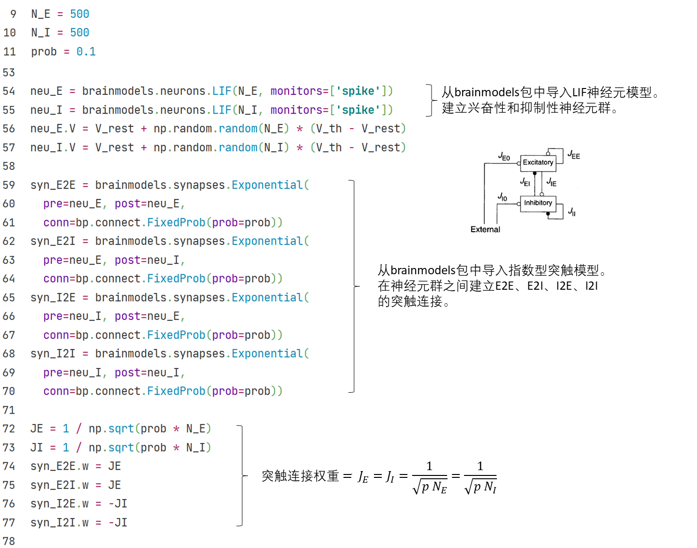
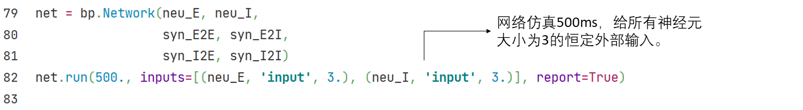

## 3.1 兴奋-抑制平衡网络

上世纪90年代初，学界发现，在大脑皮层中神经元有时表现出一种在时间上不规则的发放特征。这种特征广泛地存在于脑区中，但当时人们对它的产生机制和主要功能都了解不多。

Vreeswijk和Sompolinsky（1996）提出了**兴奋-抑制平衡网络**（E/I balanced network），希望能够解释神经元这种不规则的发放，并提示了这种结构在功能上可能的优势。

<b>图3-1 兴奋-抑制平衡网络结构 （<cite>Vreeswijk and Sompolinsky, 1996 <a href="#fn_1">1</a></cite>）</b>

图3-1画出了兴奋-抑制平衡网络的结构。该网络由兴奋性LIF神经元和和抑制性LIF神经元构成，其数量比$$N_E: N_I = 4:1$$。在网络两类神经元之间和同类神经元之内，建立了四组指数型突触连接，分别是兴奋-兴奋连接（E2E conn），兴奋-抑制连接（E2I conn），抑制-兴奋连接（I2E conn），抑制-抑制连接（I2I conn）。在代码中我们通过定义符号相反的突触权重，来指明突触连接的兴奋性或抑制性。

	

*注：LIF神经元和指数型突触的实现请参见第1节《神经元模型》和第2节《突触模型》*

兴奋-抑制平衡网络在结构上最大的特征是神经元间强随机突触连接，连接概率为$$0.1$$，属于稀疏连接。

这种强的突触连接使得网络中每个神经元都会接收到很大的来自网络内部的兴奋性和抑制性输入。但是，这两种输入一正一负相互抵消，最后神经元接收到的总输入将保持在一个相对小的数量级上，仅足以让神经元的膜电位上升到阈值电位，引发其产生动作电位。

由于突触连接和噪声带来的随机性，网络中神经元接收到的输入也在时间和空间上具有一定的随机性（尽管总体保持在阈值电位量级上），这使得神经元的发放也具有随机性，保证兴奋-抑制平衡网络能够自发产生前述的时间上不规则的发放特征。

下述仿真结果中，可以看到网络中的神经元从一开始的强同步发放慢慢变为时间上不规则的发放。

	

	

与此同时，作者还提出了这种发放特征在大脑中可能提供的功能：兴奋-抑制平衡网络可以快速跟踪外部刺激的变化。假如该网络真的是大脑中神经元产生不规则发放背后的机制，那么真实的神经元网络也可能拥有同样的特性。

如图3-2所示，当没有外部输入时，兴奋-抑制平衡网络中神经元的膜电位相对均匀且随机地分布在静息电位$$V_0$$和阈值电位$$\theta$$之间。当网络接收到一个小的外部恒定输入时，那些膜电位原本就落在阈值电位附近的神经元（图中标为红色）就能很快地发放，在网络尺度上，表现为网络的发放率随输入变化而快速改变。

<b>图3-2 兴奋-抑制平衡网络中神经元膜电位的分布（<cite>Tian et al.，2020 <a href="#fn_2">2</a></cite>）</b>

仿真证实，在这种情况下，网络对输入产生反应的延迟时间和突触的延迟时间处于同一量级，并且二者都远小于单神经元从静息电位开始积累同样大小的外部输入直到产生动作电位所需的延迟时间（Vreeswijk和Sompolinsky，1996；Tian et al.，2020）。因此，兴奋-抑制平衡网络面对外部输入的变化可以快速反应，改变自身的活跃水平。

### 参考资料

[1] Van Vreeswijk, Carl, and Haim Sompolinsky. "Chaos in neuronal networks with balanced excitatory and inhibitory activity." *Science* 274.5293 (1996): 1724-1726.

[2] Tian, Gengshuo, et al. "Excitation-Inhibition Balanced Neural Networks for Fast Signal Detection." *Frontiers in Computational Neuroscience* 14 (2020): 79.