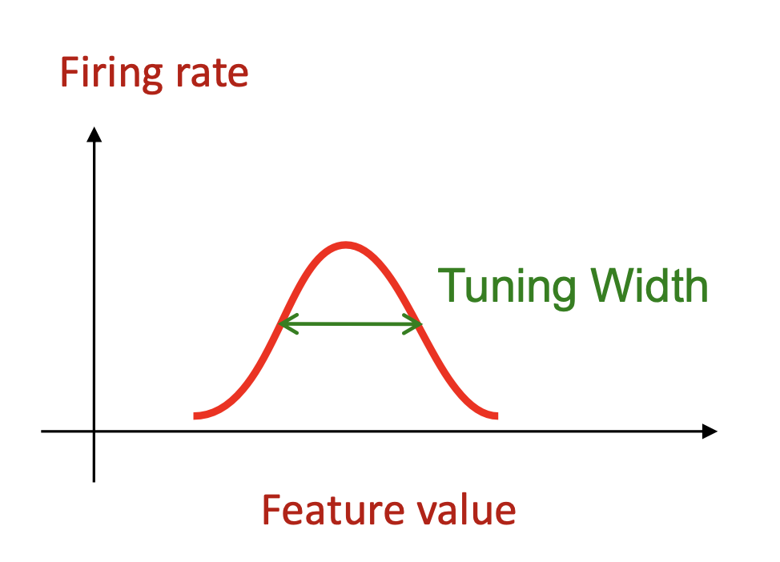
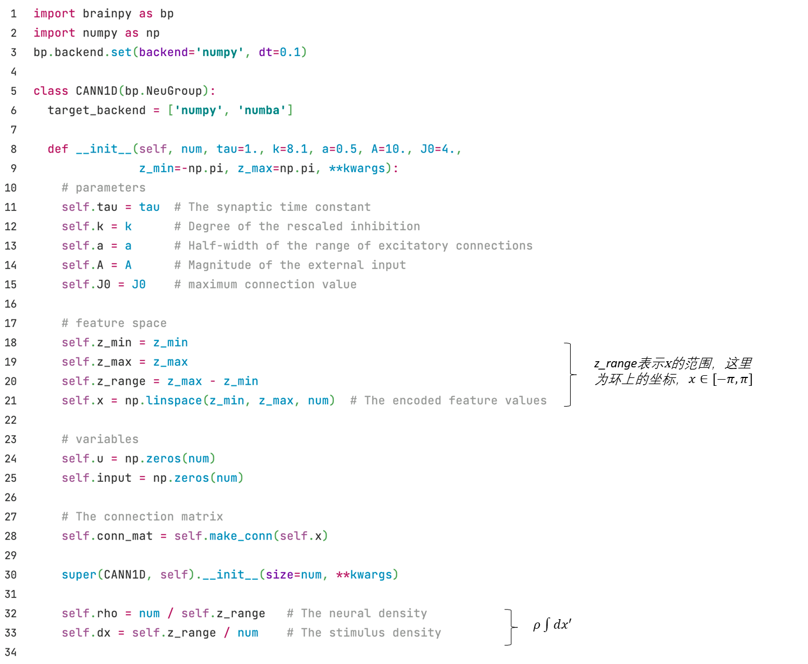
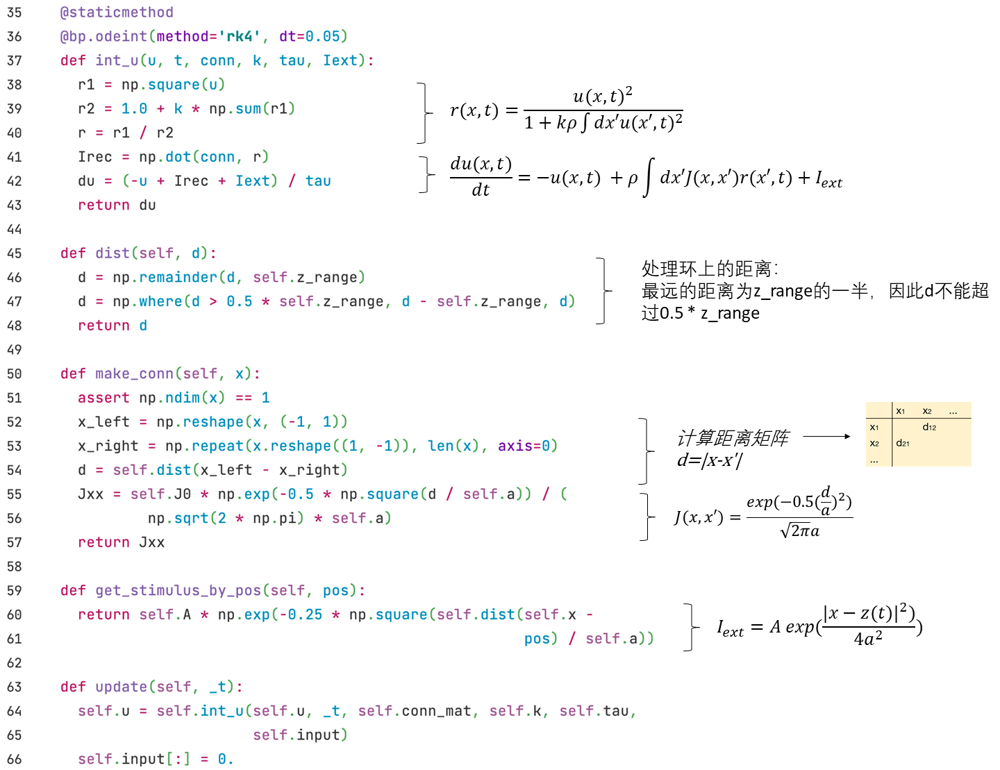

## 3.3 连续吸引子模型（CANN）

在本节中，我们关注如何用神经网络来做计算的问题，例如，我们在做预测跟踪时的神经编码是怎样的呢？Georgopoulos和他的同事（1995）关于运动控制的实验结果发现，单个神经元的活动可以绘制成调谐曲线（tuning curve，如图3-6），每个神经元有一个优选的方向（即对这一方向的刺激的活动最强）。预测跟踪

<div align="center">
  
  <br>
  <strong>图3-6 调谐曲线</strong>
</div>
<div><br></div>

那么，什么样的网络连接可以产生调谐曲线呢？这里我们要介绍其中一种可能方式——连续吸引子神经网络（CANN）。CANN最开始是由Amari（1977）等计算神经科学先驱从纯理论角度提出来的，后来被广泛应用于建模多种神经信息处理，包括头朝向编码、空间位置编码等。我们以一维的CANN为例，介绍它在神经元群编码及预测跟踪方面的功能。


<div align="center">
  
  <br>
  <strong>图3-7 连续吸引子神经网络</strong> (引自 <cite>Wu et al., 2008 <sup><a href="#fn_1">1</a></sup></cite>)
</div>
<div><br></div>

图3-7呈现了一维CANN的结构，神经元的突触总输入$$u$$的动力学方程如下：
$$
\tau \frac{du(x,t)}{dt} = -u(x,t) + \rho \int dx' J(x,x') r(x',t)+I_{ext}
$$

其中x表示神经元的参数空间位点，$$r(x', t)$$为神经元(x')的发放率，由以下公式给出:

$$
r(x,t) = \frac{u(x,t)^2}{1 + k \rho \int dx' u(x',t)^2}
$$

而神经元(x)和(x')之间的兴奋性连接强度$$J(x, x')$$由高斯函数给出:

$$
J(x,x') = \frac{1}{\sqrt{2\pi}a}\exp(-\frac{|x-x'|^2}{2a^2})
$$

外界输入$$I_{ext}$$与位置$$z(t)$$有关，公式如下：

$$
I_{ext} = A\exp\left[-\frac{|x-z(t)|^2}{4a^2}\right]
$$

用BrainPy实现的代码如下，我们通过继承``bp.NeuGroup``来创建一个``CANN1D``的类。





这里我们用函数``dist``与``make_conn``来计算两群神经元之间的连接强度$$J(x, x')$$。其中``dist``函数用来处理环上的距离。

接下来我们可以调用刚才定义的``get_stimulus_by_pos``方法获取外界输入电流大小。例如在简单的群体编码（population coding）中，我们给一个``pos=0``的外界输入，并按以下方式运行：


```python
cann = CANN1D(num=512, k=0.1, monitors=['u'])

I1 = cann.get_stimulus_by_pos(0.)
Iext, duration = bp.inputs.constant_current([(0., 1.), (I1, 8.), (0., 8.)])
cann.run(duration=duration, inputs=('input', Iext))
```

我们写一个``plot_animate``的函数来方便重复调用``bp.visualize.animate_1D``画结果图。

``` python
# 定义函数
def plot_animate(frame_step=5, frame_delay=50):
    bp.visualize.animate_1D(dynamical_vars=[{'ys': cann.mon.u, 'xs': cann.x,
                                             'legend': 'u'}, {'ys': Iext,
                                             'xs': cann.x, 'legend': 'Iext'}],
                            frame_step=frame_step, frame_delay=frame_delay,
                            show=True)

# 调用函数
plot_animate(frame_step=1, frame_delay=100)
```


可以看到，$$u$$的形状编码了外界输入的形状。

现在我们给外界输入加上随机噪声，看看$$u$$的形状如何变化。


```python
cann = CANN1D(num=512, k=8.1, monitors=['u'])

dur1, dur2, dur3 = 10., 30., 0.
num1 = int(dur1 / bp.backend.get_dt())
num2 = int(dur2 / bp.backend.get_dt())
num3 = int(dur3 / bp.backend.get_dt())
Iext = np.zeros((num1 + num2 + num3,) + cann.size)
Iext[:num1] = cann.get_stimulus_by_pos(0.5)
Iext[num1:num1 + num2] = cann.get_stimulus_by_pos(0.)
Iext[num1:num1 + num2] += 0.1 * cann.A * np.random.randn(num2, *cann.size)
cann.run(duration=dur1 + dur2 + dur3, inputs=('input', Iext))

plot_animate()
```


我们可以看到$$u$$的形状保持一个类似高斯的钟形，这表明CANN可以进行模板匹配。

接下来我们用``np.linspace``函数来产生不同的位置，得到随时间平移的输入，我们将会看到$$u$$跟随着外界输入移动，即平滑跟踪。


```python
cann = CANN1D(num=512, k=8.1, monitors=['u'])

dur1, dur2, dur3 = 20., 20., 20.
num1 = int(dur1 / bp.backend.get_dt())
num2 = int(dur2 / bp.backend.get_dt())
num3 = int(dur3 / bp.backend.get_dt())
position = np.zeros(num1 + num2 + num3)
position[num1: num1 + num2] = np.linspace(0., 12., num2)
position[num1 + num2:] = 12.
position = position.reshape((-1, 1))
Iext = cann.get_stimulus_by_pos(position)
cann.run(duration=dur1 + dur2 + dur3, inputs=('input', Iext))

plot_animate()
```


### 参考资料

<span id="fn_1"></span>[1] Wu, Si, Kosuke Hamaguchi, and Shun-ichi Amari. "Dynamics and computation of continuous attractors." *Neural computation*20.4 (2008): 994-1025.

