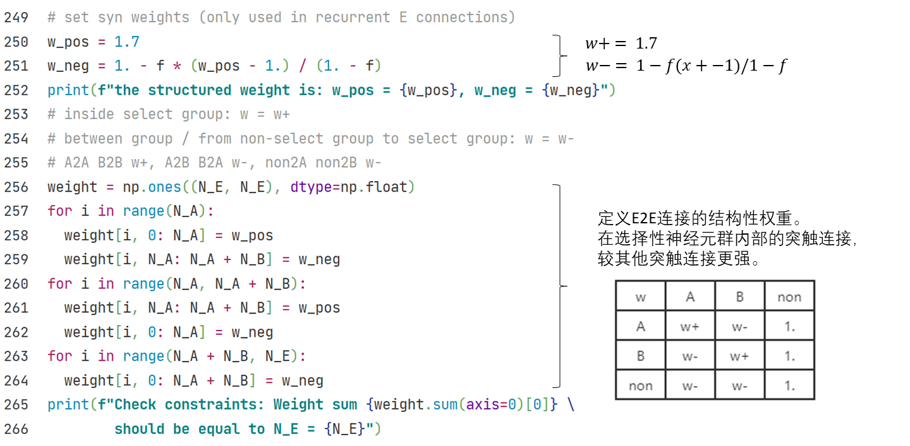
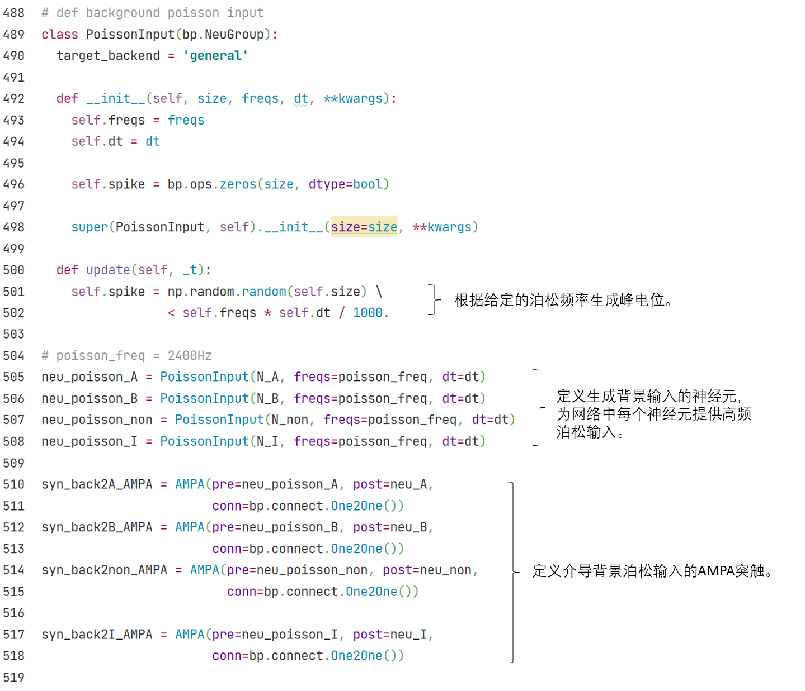
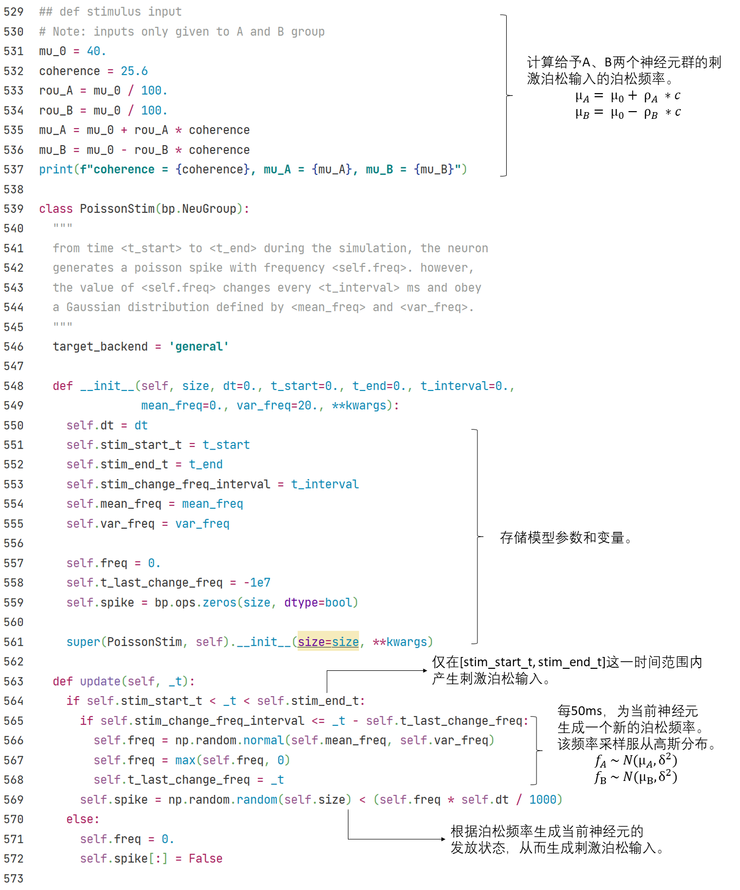
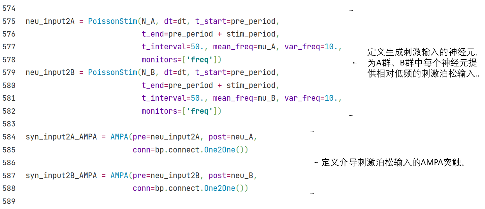

## 3.2 抉择网络

计算神经科学的网络建模也可以对标特定的生理实验任务，比如视觉运动区分实验（Parker和Newsome，1998；Roitman和Shadlen，2002）。

在该实验中，参与实验的猕猴将观看一段随机点的运动展示。在展示过程中，随机点以一定比例（该比例被定义为一致度（coherence））向特定方向运动，其他点则向随机方向运动。猕猴被要求判断随机点一致运动的方向，并通过眼动给出答案。同时，研究者通过电生理手段记录猕猴LIP神经元的活动。

<center> </center>

<center><b>图3-3 生理实验中随机点的运动示意图（<cite>Gerstner et al., 2014<sup><a href="#fn_1">1</a></sup></cite>）</b></center>

Wang等人（2002；2006）先后提出了本节所述的脉冲神经网络模型和发放率神经网络模型，希望建模在视觉运动区分实验中猕猴大脑新皮层的抉择回路的活动。


------

### 3.2.1 脉冲神经网络

Wang（2002）首先提出了本节所述的抉择脉冲神经网络。如图3-4所示，网络基于3.1节所述的兴奋-抑制平衡网络。兴奋性神经元和抑制型神经元的数量比是$$N_E:N_I = 4:1$$，调整参数使得网络处在平衡状态下。

<center></center>

<center><b>图3-4 抉择网络结构（<cite>Wang，2002<sup><a href="#fn_2">2</a></sup></cite>）</b></center>

为了简化模型，实验被设定为一个二选一的任务：在兴奋性神经元群中，特别地标出两个选择性子神经元群A和B，其他的兴奋性神经元称为非选择性神经元，用下标$$_{non}$$表示。A群和B群的数目均为兴奋性神经元的0.15倍（$$N_A = N_B = 0.15N_E$$），它们分别代表着两个相反的运动方向，可以视作随机点要么向左，要么向右，没有第三个方向，网络的抉择结果也必须在这两个子群中产生。非选择性神经元的数目为$$N_{non} = (1-2*0.15)N_E$$。

<center>	</center>

抉择网络中共有四组突触——E2E，E2I，I2E和I2I突触连接，其中兴奋性突触实现为AMPA突触，抑制性突触实现为GABAa突触。

由于网络需要在A群和B群之间作出抉择，所以这两个子神经元群之间必须形成一种竞争关系。一个选择性子神经元群应当激活自身，并同时抑制另一个选择性子神经元群。

因此，网络中的E2E连接被建模为有结构的连接。如表3-1所示，$$w+ > 1 > w-$$。这样，在A群或B群的内部，兴奋性突触连接更强，形成了一种相对的自激活；而在A、B两个选择性子神经元群之间或是A群、B群和非选择性子神经元群之间，兴奋性突触连接较弱，实际上形成了相对的抑制。A和B两个神经元因此产生竞争，迫使网络做出二选一的抉择。

<center><b>表3-1 决策网络中兴奋性神经元间连接权重的分布</b></center>
<center></center>

<center>	</center>

抉择网络接受的外部输入可分为两类：

1）所有神经元都收到从其他脑区传来的非特定的背景输入，表示为AMPA突触介导的高频泊松输入（2400Hz）。

<center>	</center>

2）仅选择性的A群和B群收到外部传来的刺激输入，表示为AMPA突触介导的较低频泊松输入（约100Hz内）。

给予A和B神经元群的泊松输入的频率均值（$$\mu_A$$、$$\mu_B$$）有一定差别，对应到生理实验上，代表猕猴看到的随机点朝两个相反方向运动的比例（用coherence表示）不同。这种输入上的差别引导着网络在两个子神经元群中做出抉择。
$$
\rho_A = \rho_B = \mu_0/100
$$

$$
\mu_A = \mu_0 + \rho_A * coherence
$$

$$
\mu_B = \mu_0 + \rho_B * coherence
$$

每50毫秒，泊松输入的实际频率$$f_x$$遵循由均值$$\mu_x$$ 和方差$$\delta^2$$定义的高斯分布，重新进行一次采样。
$$
f_A \sim N(\mu_A, \delta^2)
$$

$$
f_B \sim N(\mu_B, \delta^2)
$$

<center>	</center>

<center>	</center>

下图中可以看到，在本次仿真中，子神经元群A收到的刺激输入平均大于B收到的刺激输入。经过一定的延迟时间，A群的活动水平明显高于B群，说明网络做出了正确的选择。

<center></center>


------

### 3.2.2 发放率神经网络

我们在上一节中介绍了Wang（2002）提出的抉择模型，现在来介绍他们后续做的一个基于发放率（firing rate）的简化模型（Wong & Wang, 2006[^1]）。该模型的实验背景与上一节的相同，在脉冲神经网络模型的基础上，他们使用平均场近似（mean-field approach）等方法，使用一群神经元的发放率来表示整群神经元的状态，而不再关注每个神经元的脉冲。他们拟合出输入-输出函数（input-output function）来表示给一群神经元一个外界输入电流$$I$$时，这群神经元的发放率$$r$$如何改变，即$$r=f(I)$$。经过这样的简化后，我们就可以很方便地对其进行动力学分析。


<div align="center">
  
  <br>
  <strong>图3-5 简化的抉择模型</strong> (引自 <cite>Wong & Wang, 2006 <sup><a href="#fn_3">3</a></sup></cite>)
</div>
<div><br></div>

基于发放率的抉择模型如图3-5所示，$$S_1$$（蓝色）和$$S_2$$（红色）分别表示两群神经元的状态，同时也分别对应着两个选项。他们都由兴奋性的神经元组成，且各自都有一个循环（recurrent）连接。而同时它们都会给对方一个抑制性的输入，以此形成相互竞争的关系。该模型的动力学方程如下：
$$
\frac{dS_1} {dt} = -\frac {S_1} \tau + (1-S_1) \gamma r_1
$$

$$
\frac{dS_2} {dt} = -\frac {S_2} \tau + (1-S_2) \gamma r_2
$$

其中$$\tau$$为时间常数，$$\gamma$$为拟合得到的常数， $$r_1$$ 和 $$r_2$$ 分别为两群神经元的发放率，其输入-输出函数为：

$$
r_i = f(I_{syn, i})
$$

$$
f(I)= \frac {aI-b} {1- \exp [-d(aI-b)]}
$$

$$I_{syn, i}$$ 的公式由图3-5的模型结构给出：

$$
I_{syn, 1} = J_{11} S_1 - J_{12} S_2 + I_0 + I_1
$$

$$
I_{syn, 2} = J_{22} S_2 - J_{21} S_1 + I_0 + I_2
$$


其中$$I_0$$为背景电流，外界输入 $$I_1, I_2$$ 则由总输入的强度 $$\mu_0$$ 及一致性（coherence） $$c'$$ 决定。一致性越高，则越明确$$S_1$$是正确答案，而一致性越低则表示越随机。公式如下：

$$
I_1 = J_{\text{A, ext}} \mu_0 (1+\frac {c'}{100\%})
$$

$$
I_2 = J_{\text{A, ext}} \mu_0 (1-\frac {c'}{100\%})
$$


接下来，我们将继承``bp.NeuGroup``类，并用BrainPy提供的相平面分析方法``bp.analysis.PhasePlane``进行动力学分析。首先，我们把上面的动力学公式写到一个``derivative``函数中，定义一个Decision类（本章代码请查看[附录](../appendix/networks.md)，或[点此](../appendix/networks.ipynb)下载jupyter notebook）。


接下来，我们想要看模型在不同输入情况下的动力学，因此，我们先定义一个对抉择模型做相平面分析的方法，可以让我们改变``I``（即外界输入强度$$\mu_0$$）和``coh``（即输入的一致性$$c'$$），而固定了参数的值等。


现在让我们来看看当没有外界输入，即$$\mu_0 = 0$$时的动力学。


```python
phase_analyze(I=0., coh=0.)
```

    plot nullcline ...
    plot fixed point ...
    Fixed point #1 at s2=0.06176109215560733, s1=0.061761097890810475 is a stable node.
    Fixed point #2 at s2=0.029354239100062428, s1=0.18815448592736211 is a saddle node.
    Fixed point #3 at s2=0.0042468423702408655, s1=0.6303045696241589 is a stable node.
    Fixed point #4 at s2=0.6303045696241589, s1=0.004246842370235128 is a stable node.
    Fixed point #5 at s2=0.18815439944520335, s1=0.029354240536530615 is a saddle node.
    plot vector field ...


由此可见，用BrainPy进行动力学分析是非常方便的。向量场和不动点 (fixed point)表示了不同初始值下最终会落在哪个选项。

这里，x轴是$$S_2$$，代表选项2，y轴是$$S_1$$，代表选项1。可以看到，左上的不动点表示选项1，右下的不动点表示选项2，左下的不动点表示没有选择。

现在让我们看看当我们把外部输入强度固定为30时，在不同一致性（coherence）下的相平面。


```python
# coherence = 0%
print("coherence = 0%")
phase_analyze(I=30., coh=0.)

# coherence = 51.2%
print("coherence = 51.2%")
phase_analyze(I=30., coh=0.512)

# coherence = 100%
print("coherence = 100%")
phase_analyze(I=30., coh=1.)
```

    coherence = 0%
    plot nullcline ...
    plot fixed point ...
    Fixed point #1 at s2=0.6993504413889349, s1=0.011622049526766405 is a stable node.
    Fixed point #2 at s2=0.49867489858358865, s1=0.49867489858358865 is a saddle node.
    Fixed point #3 at s2=0.011622051540013889, s1=0.6993504355529329 is a stable node.
    plot vector field ...


    coherence = 51.2%
    plot nullcline ...
    plot fixed point ...
    Fixed point #1 at s2=0.5673124813731691, s1=0.2864701069327971 is a saddle node.
    Fixed point #2 at s2=0.6655747347157656, s1=0.027835279565912054 is a stable node.
    Fixed point #3 at s2=0.005397687847426814, s1=0.7231453520305031 is a stable node.
    plot vector field ...


    coherence = 100%
    plot nullcline ...
    plot fixed point ...
    Fixed point #1 at s2=0.0026865954387078755, s1=0.7410985604497689 is a stable node.
    plot vector field ...


### 参考资料

<span id="fn_1"></span>[1] Gerstner, Wulfram, et al. Neuronal dynamics: From single neurons to networks and models of cognition. Cambridge University Press, 2014.

<span id="fn_2"></span>[2] Wang, Xiao-Jing. "Probabilistic decision making by slow reverberation in cortical circuits." *Neuron* 36.5 (2002): 955-968.

<span id="fn_3"></span>[3] Wong, K.-F. & Wang, X.-J. A Recurrent Network Mechanism of Time Integration in Perceptual Decisions.  J. Neurosci. 26, 1314–1328 (2006).