## 2.1 突触模型

我们在前面的章节中已经学习了如何建模神经元，那么神经元之间是怎么连接起来的呢？神经元的动作电位是如何在不同神经元之间传导的呢？这里，我们将介绍如何用BrainPy来模拟神经元之间的沟通。

> 注：本章所述模型的完整BrainPy代码请见[附录](../appendix/synapses.md)，或[右键点此](../appendix/synapses.ipynb)下载jupyter notebook版本。

### 2.1.1 化学突触

#### 生物背景

图2-1描述了神经元之间信息传递的生物过程。当突触前神经元的动作电位传递到轴突的末端（terminal）时，突触前神经元会释放**神经递质**（又称递质）。神经递质会和突触后神经元上的受体结合，从而引起突触后神经元膜电位的改变，这种改变称为突触后电位（PSP）。根据神经递质种类的不同，突触后电位可以是兴奋性的或抑制性的。例如**谷氨酸**（Glutamate）就是一种重要的兴奋性神经递质，而**GABA**则是一种重要的抑制性神经递质。

神经递质与受体的结合可能会导致离子通道的打开（**离子型**受体）或改变化学反应的过程（**代谢型**受体）。

在本节中，我们将介绍如何使用BrainPy来实现一些常见的突触模型，主要有：

- **AMPA**和**NMDA**：它们都是谷氨酸的离子型受体，被结合后都可以直接打开离子通道。但是NMDA通常会被镁离子（Mg$$^{2+}$$）堵住，无法对谷氨酸做出反应。由于镁离子对电压敏感，当突触后电位超过镁离子的阈值以后，镁离子就会离开NMDA通道，让NMDA可以对谷氨酸做出反应。因此，NMDA的反应是比较慢的。
- **GABA<sub>A</sub>**和**GABA<sub>B</sub>**：它们是GABA的两类受体，其中GABA<sub>A</sub>是离子型受体，通常可以产生快速的抑制性电位；而GABA<sub>B</sub>则为代谢型受体，通常会产生缓慢的抑制性电位。


<div style="text-align:center">
  
  <br>
    <strong> 图 2-1 生物突触 </strong> (引自 <cite>Gerstner et al., 2014 <sup><a href="#fn_1">1</a></sup></cite>)
</div>
<div><br></div>

为了简便地建模从神经递质释放到突触后神经元膜电位改变的过程，我们可以使用门控变量$$s$$来描述每当突触前神经元产生动作电位时，有多少比例的离子通道会被打开。让我们从AMPA的例子开始，看看如何建立突触模型并用BrainPy实现。


#### AMPA模型

如前所述，AMPA（a-氨基-3-羟基-5-甲基-4-异恶唑丙酸）受体是一种离子型受体，也就是说，当它被神经递质结合后会立即打开离子通道，从而引起突触后神经元膜电位的变化。

我们可以用马尔可夫过程来描述离子通道的开关。如图2-2所示，$$s$$代表通道打开的概率，$$1-s$$代表离子通道关闭的概率，$$\alpha$$和$$\beta$$是转移概率（transition probability）。由于神经递质能让离子通道打开，所以从$$1-s$$到$$s$$的转移概率受神经递质浓度（以[T]表示）影响。

<div style="text-align:center">
  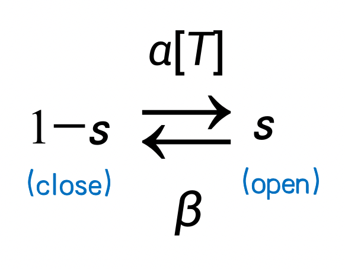 
  <br>	
  <strong> 图2-2 离子通道动力学的马尔可夫过程 </strong>
</div>
<div><br></div>

把该过程用微分方程描述，得到以下式子。

$$
\frac {ds}{dt} = \alpha [T] (1-s) - \beta s
$$

其中，$$\alpha [T]$$ 表示从状态$$(1-s)$$到状态$$(s)$$的转移概率，即激活速率；$$\beta$$ 表示从$$s$$到$$(1-s)$$的转移概率，即失活速率。

下面我们来看看如何用BrainPy去实现这样一个模型。首先，我们要定义一个类，因为突触是连接两个神经元的，所以这个类继承自``bp.TwoEndConn``。在这个类中，和神经元模型一样，我们用一个``derivative``函数来实现上述微分方程，并在后面的``__init__``函数中初始化这个函数，指定用``bp.odeint``来解这个方程，并指定数值积分方法。由于这微分方程是线性的，我们选用``exponential_euler``方法。

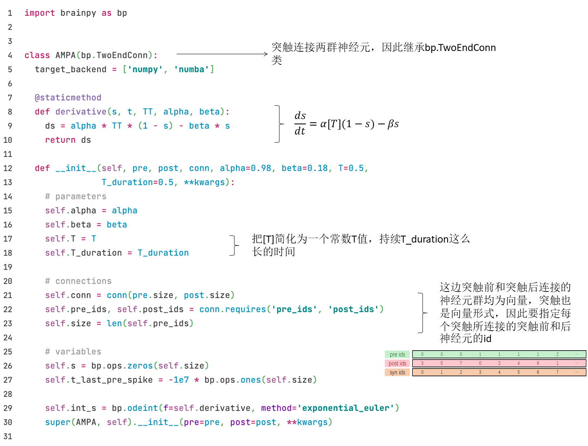

然后我们在``update``函数中更新$$s$$。

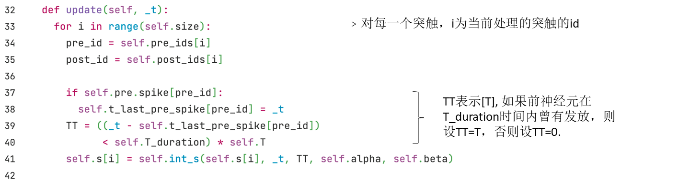

我们已经定义好了一个AMPA类，现在可以画出$$s$$随时间变化的图了。我们首先写一个``run_syn``函数来方便之后运行更多的突触模型，然后把AMPA类和需要自定义的变量传入这个函数来运行并画图。

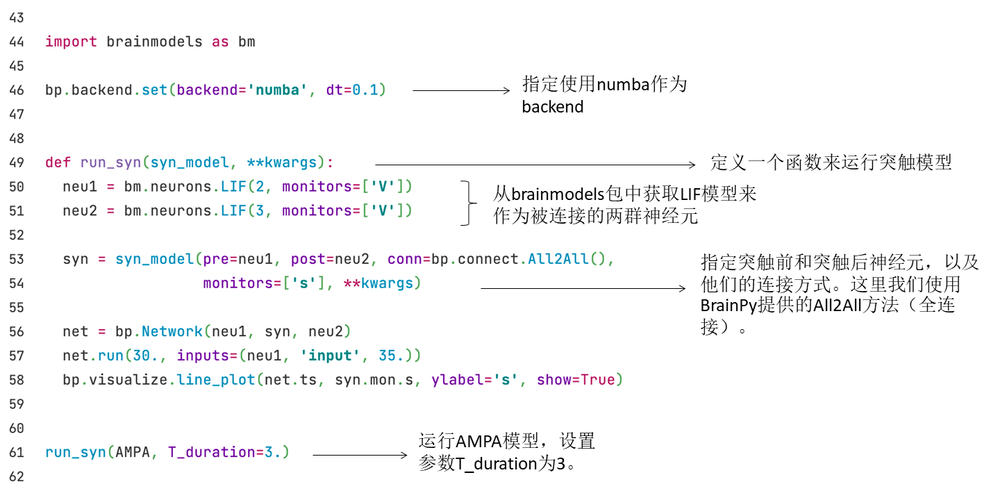

运行以上代码，即可看到以下的结果：


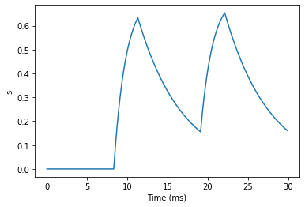

由上图可以看出，当突触前神经元产生一个动作电位，$$s$$的值会先增加，然后衰减。


#### NMDA模型

如前所述，NMDA受体一开始被镁离子堵住，而当膜电位达到一定阈值后，镁离子则会移开。我们用$$c_{Mg}$$表示镁离子的浓度，它对突触后膜的电导$$g$$的影响可以由以下公式描述：

$$
g_{\infty} =(1+{e}^{-\alpha V} \cdot \frac{c_{Mg} } {\beta})^{-1}
$$

$$
g = \bar{g} \cdot g_{\infty}  s
$$

其中$$g_{\infty}$$代表了镁离子浓度的作用，其值随着镁离子浓度增加而减小；而随着电压$$V$$增加，$$g_{\infty}$$较不受$$c_{Mg}$$影响。$$\alpha, \beta$$和$$\bar{g}$$是一些常数。门控变量$$s$$和AMPA模型类似，其动力学由以下公式给出：
$$
\frac{d s}{dt} =-\frac{s}{\tau_{\text{decay}}}+a x(1-s)
$$

$$
\frac{d x}{dt} =-\frac{x}{\tau_{\text{rise}}}
$$

$$
\text{if (pre fire), then} \ x \leftarrow x+ 1
$$

其中，$$\tau_{\text{decay}}$$和$$\tau_{\text{rise}}$$分别为$$s$$衰减及上升的时间常数，$$a$$是参数。

接下来我们用BrainPy来实现NMDA模型，代码如下。

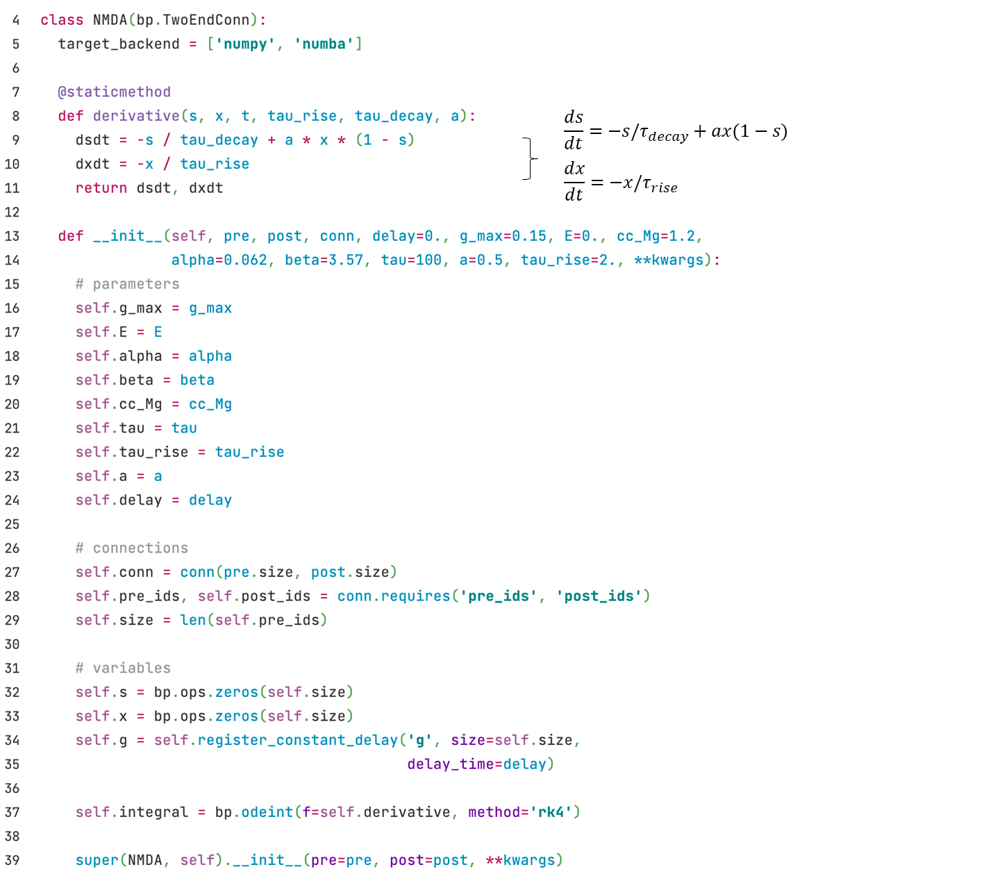

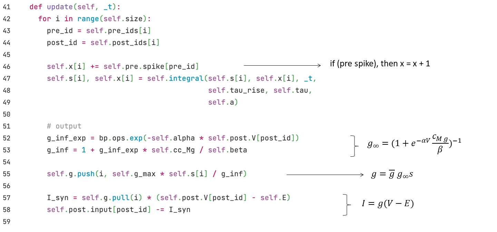

由于我们在实现AMPA模型时已经定义了``run_syn``函数，在这里我们可以直接调用：

``` python
run_syn(NMDA)
```

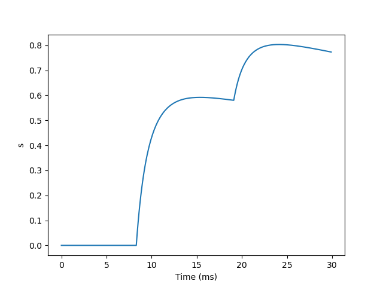

由图可以看出，NMDA的衰减过程非常缓慢，第一个突触前神经元的动作电位引起的$$s$$增加后还没怎么衰减，第二个的值就加上去了，由于我们这里只跑了30ms的模拟，还看不到NMDA衰退的过程。


#### GABA<sub>B</sub>模型

GABA<sub>B</sub>是一种代谢型受体，神经递质和受体结合后不会直接打开离子通道，而是通过G蛋白作为第二信使来起作用。因此，这里我们用$$[R]$$表示多少比例的受体被激活，并用$$[G]$$表示激活的G蛋白的浓度，$$s$$由$$[G]$$调节，公式如下：
$$
\frac{d[R]}{dt} = k_3 [T](1-[R])- k_4 [R]
$$

$$
\frac{d[G]}{dt} = k_1 [R]- k_2 [G]
$$

$$
s =\frac{[G]^{4}} {[G]^{4}+K_{d}}
$$

$$[R]$$的动力学类似于AMPA模型中的$$s$$，受神经递质浓度$$[T]$$影响，$$k_3, k_4$$表示转移概率。$$[G]$$的动力学受$$[R]$$影响，并由参数$$k_1, k_2$$控制。$$K_d$$为一个常数。

用BrainPy实现的代码如下。

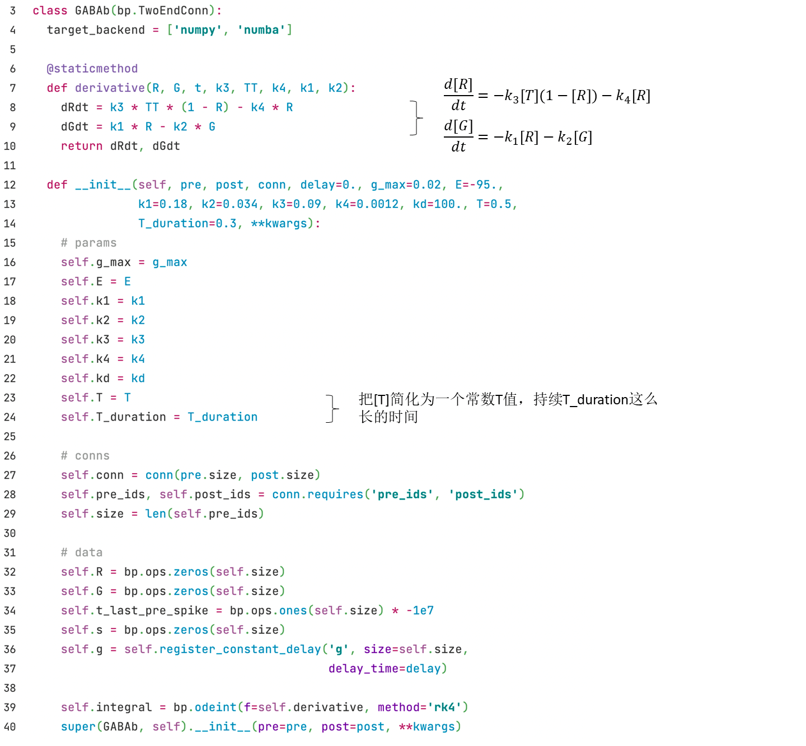

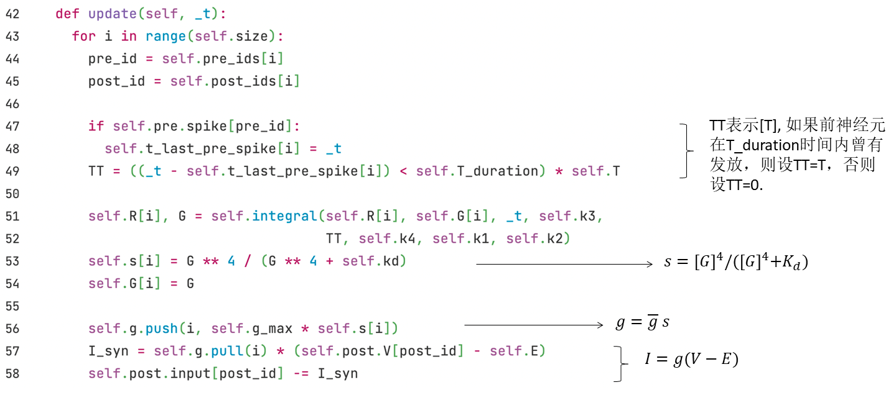

由于GABA<sub>B</sub>的动力学和NMDA一样，也是非常缓慢的，这里我们不再用前面写的只有30ms模拟的``run_syn``函数，而是通过调用BrainPy提供的``bp.inputs.constant_current``方法，先给20ms的输入，接着看剩余1000ms在没有外界输入情况下的衰减。

``` python
neu1 = bm.neurons.LIF(2, monitors=['V'])
neu2 = bm.neurons.LIF(3, monitors=['V'])
syn = GABAb(pre=neu1, post=neu2, conn=bp.connect.All2All(), monitors=['s'])
net = bp.Network(neu1, syn, neu2)

# input
I, dur = bp.inputs.constant_current([(25, 20), (0, 1000)])
net.run(dur, inputs=(neu1, 'input', I))

bp.visualize.line_plot(net.ts, syn.mon.s, ylabel='s', show=True)
```

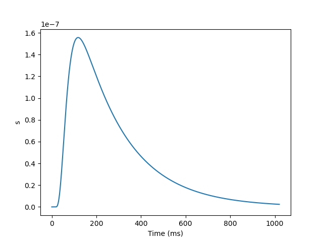

结果显示，GABA<sub>B</sub>的衰减持续数百毫秒。


#### 基于电流与基于电导的模型

细心的读者应该发现，我们刚才对GABA<sub>B</sub>门控变量$$s$$的建模并没有显示出其引起抑制性电位的特点。要体现出兴奋性和抑制性，我们不仅需要建模门控变量$$s$$，还需要建模通过突触的电流$$I$$（作为突触后神经元的输入）。根据突触电流是否受突触后神经元膜电位的影响不同，分为**基于电流（current-based）**与**基于电导（conductance-based）**的两种模型。

##### （1）基于电流（Current-based）的模型

基于电流的模型公式如下：

$$
I \propto s
$$

在代码实现上，我们通常会乘上一个权重$$w$$。我们可以通过调整权重$$w$$的正负值来实现兴奋性和抑制性突触。另外，我们通过使用BrainPy提供的``register_constant_delay``函数给变量``I_syn``加上延迟时间来实现突触的延迟。


##### （2）基于电导（Conductance-based）的模型

在基于电导的模型中，电导为$$g=\bar{g}s$$。因此，根据欧姆定律得公式如下：
$$
I=\bar{g}s(V-E)
$$

这里$$E$$是一个反转电位（reverse potential），它可以决定$$I$$的方向是抑制还是兴奋。例如，当静息电位约为-65mV时，减去比它更低的$$E$$，例如-75mV，将变为正，从而改变公式中电流的方向并产生抑制电流。兴奋性突触的$$E$$一般为比较高的值，如0mV。

代码实现上，可以把延迟时间应用到变量``g``上。

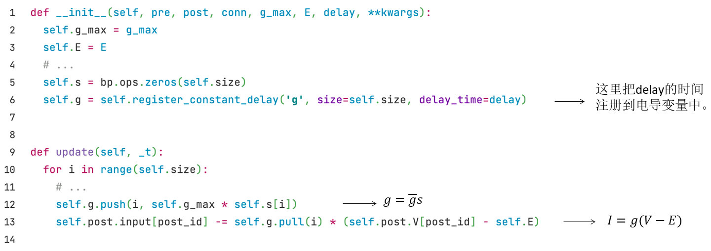


现在可以回顾一下我们刚才实现的NMDA模型和GABA<sub>B</sub>模型，它们都是基于电导的模型，在NMDA模型中，$$E=0mV$$，因此产生兴奋性电流；而在GABA<sub>B</sub>模型中，$$E=-95mV$$，产生抑制性电流。


#### 抽象的简化模型

前面我们建模了几种经典的化学突触模型，它们的门控变量$$s$$的动力学都有着先上升后下降的特征。当我们不需要具体地建模某种生物学突触时，只要把握了突触的基本动力学特征（先上升后下降）即可。这里，我们会介绍四种抽象的简化模型及其在BrainPy上的实现，这些抽象模型既可以是基于电流的，也可以是基于电导的模型，可以根据需要选择。

##### (1) 双指数差（Differences of two exponentials）

我们首先来看**双指数差**（Differences of two exponentials）模型，它有两个指数项相减，公式如下：

$$
s = \frac {\tau_1 \tau_2}{\tau_1 - \tau_2} (\exp(-\frac{t - t_s}{\tau_1})
- \exp(-\frac{t - t_s}{\tau_2}))
$$

其中 $$t_s$$ 表示突触前神经元产生动作电位的时间，$$\tau_1$$和$$\tau_2$$为时间常数。

在BrainPy的实现中，我们采用以下微分方程形式：
$$
		\frac {ds} {dt} = x
$$

$$
\frac {dx}{dt} =- \frac{\tau_1+\tau_2}{\tau_1 \tau_2}x - \frac s {\tau_1 \tau_2}
$$

$$
\text{if (fire), then} \ x \leftarrow x+ 1
$$

这里我们用``update``函数来控制$$x$$增加的逻辑。代码如下：

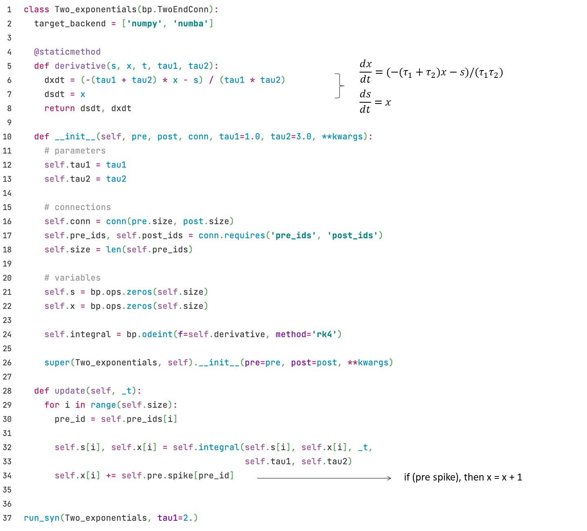


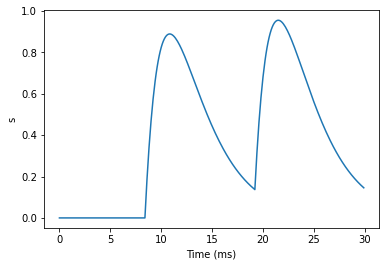


##### (2) Alpha突触

**Alpha突触**的动力学由以下公式给出：
$$
s = \frac{t - t_s}{\tau} \exp(-\frac{t - t_s}{\tau})
$$
和双指数差模型类似， $$t_s$$ 表示突触前神经元产生动作电位的时间，不同的是这里只有一个时间常数$$\tau$$。微分方程形式如下：
$$
\frac {ds} {dt} = x
$$

$$
 \frac {dx}{dt} =- \frac{2x}{\tau} - \frac s {\tau^2}
$$

$$
\text{if (fire), then} \ x \leftarrow x+ 1
$$

可以看出alpha模型和双指数差模型其实很相似，相当于是$$\tau=\tau_1 = \tau_2$$。因此，代码实现上也很接近：

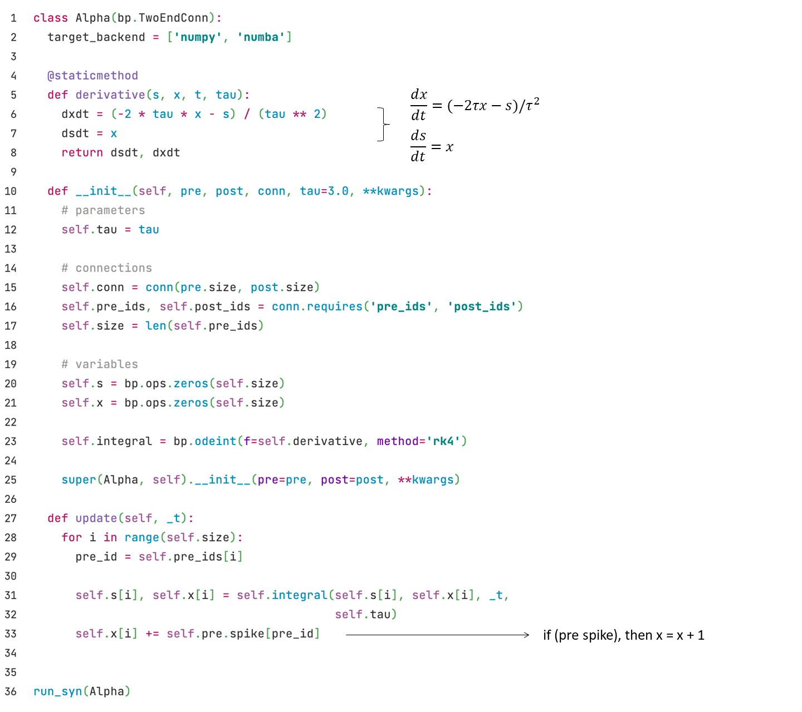


##### (3) 单指数衰减（Single exponential decay）

下面我们来介绍一种更加简化的模型，它忽略了上升的过程，而只建模了衰减（decay）的过程。**单指数衰减**（Single exponential decay）模型用一个指数项来描述衰减的过程，公式如下：
$$
\frac {ds}{dt}=-\frac s {\tau_{decay}}
$$

$$
\text{if (fire), then} \ s \leftarrow s+1
$$

代码实现如下：

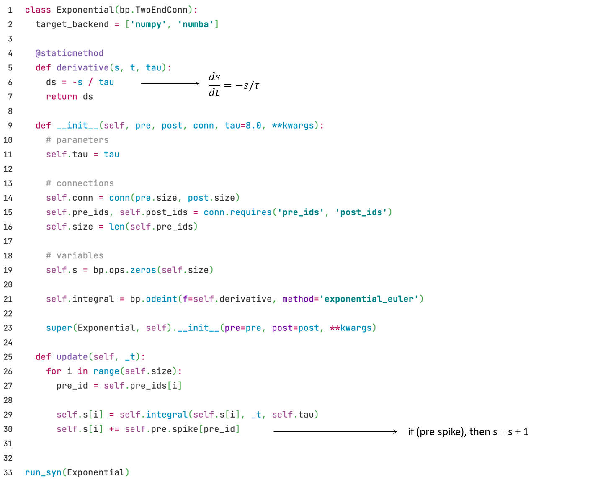


##### (4) 电压跳变（Voltage jump）

电压跳变（Voltage jump）模型比单指数衰减模型还要更加简化，它连衰退的过程也忽略了，公式如下：
$$
\text{if (fire), then} \ s \leftarrow s+1
$$

在实现上，只需要在``update``函数中更新$$s$$即可。代码如下：

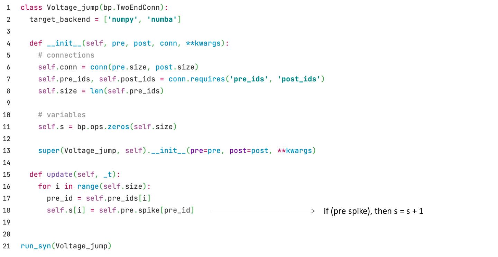


### 2.1.2 电突触

除了前面介绍的化学突触以外，电突触在我们神经系统中也很常见。

<div  style="text-align:center">
    <div style="display:grid;grid-template-columns: 1fr 3fr 1fr 3fr;grid-template-rows:1fr 3fr;justify-items:center;align-items:center">
      <div style="grid-column:1;grid-row:1;align-self:end;justify-self:end">
        <strong>(a)</strong>
      </div>
      <div style="grid-column:2;grid-row:2">
        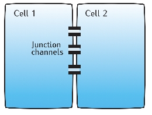
      </div>
      <div style="grid-column:3;grid-row:1;align-self:end;justify-self:end">
        <strong>(b)</strong>
      </div>
      <div style="grid-column:4;grid-row:2">
        
      </div>
    </div>
  <br>
  <strong> 图2-3 (a)</strong> 神经元间的缝隙连接. 
  <strong>(b)</strong> 等效模型. 
  <br>(引自 <cite  id="reffn_2">Sterratt et al., 2011 <sup><a href="#fn_2">2</a></sup></cite>)
</div>
<div><br></div>

如图2-3a所示，两个神经元通过连接通道（junction channels）相连，可以直接导电，这种连接又称为缝隙连接（gap junction）。因此，可以看作是两个神经元由一个常数电阻连起来，如图2-3b所示。

根据欧姆定律可得以下公式：

$$
I_{1} = w (V_{0} - V_{1})
$$

这里$$V_0$$和$$V_1$$分别为两个神经元的膜电位，突触权重$$w$$表示常数电导。

在BrainPy的实现中，只需要在``update``函数里更新即可。

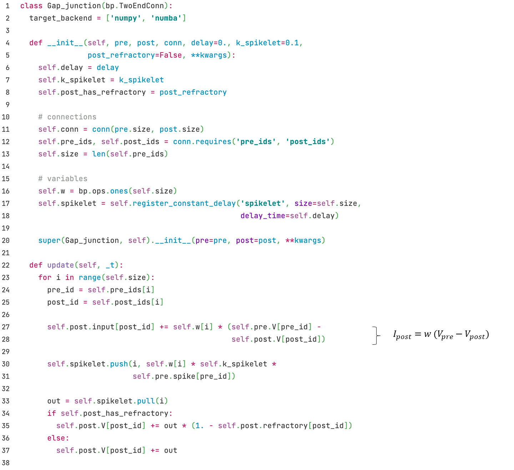

定义好了缝隙连接的类以后，我们跑模拟来看给0号神经元输入时，1号神经元的电位变化。我们首先实例化两个LIF神经元模型，并用缝隙连接把它们连接起来。然后仅给0号神经元``neu0``一个恒定的电流，``neu1``没有外界输入。


```python
import matplotlib.pyplot as plt

neu0 = bm.neurons.LIF(1, monitors=['V'], t_refractory=0)
neu0.V = bp.ops.ones(neu0.V.shape) * -10.
neu1 = bm.neurons.LIF(1, monitors=['V'], t_refractory=0)
neu1.V = bp.ops.ones(neu1.V.shape) * -10.
syn = Gap_junction(pre=neu0, post=neu1, conn=bp.connect.All2All(),
                   k_spikelet=5.)
syn.w = bp.ops.ones(syn.w.shape) * .5

net = bp.Network(neu0, neu1, syn)
net.run(100., inputs=(neu0, 'input', 30.))

fig, gs = bp.visualize.get_figure(row_num=2, col_num=1, )

fig.add_subplot(gs[1, 0])
plt.plot(net.ts, neu0.mon.V[:, 0], label='V0')
plt.legend()

fig.add_subplot(gs[0, 0])
plt.plot(net.ts, neu1.mon.V[:, 0], label='V1')
plt.legend()
plt.show()
```


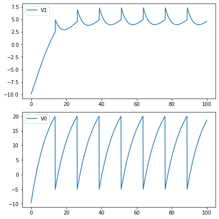

结果图中，下图$$V_0$$表示0号神经元的膜电位变化，而上图$$V_1$$为1号神经元的膜电位。0号神经元因为有电流输入而有持续的发放，并给1号神经元输入，导致$$V_1$$产生阈值下的改变。


### 参考资料

<span id="fn_1"></span>[1] Gerstner, Wulfram, et al. *Neuronal dynamics: From single neurons to networks and models of cognition*. Cambridge University Press, 2014.


<span id="fn_2"></span>[2] Sterratt, David, et al. *Principles of computational modelling in neuroscience*. Cambridge University Press, 2011.

